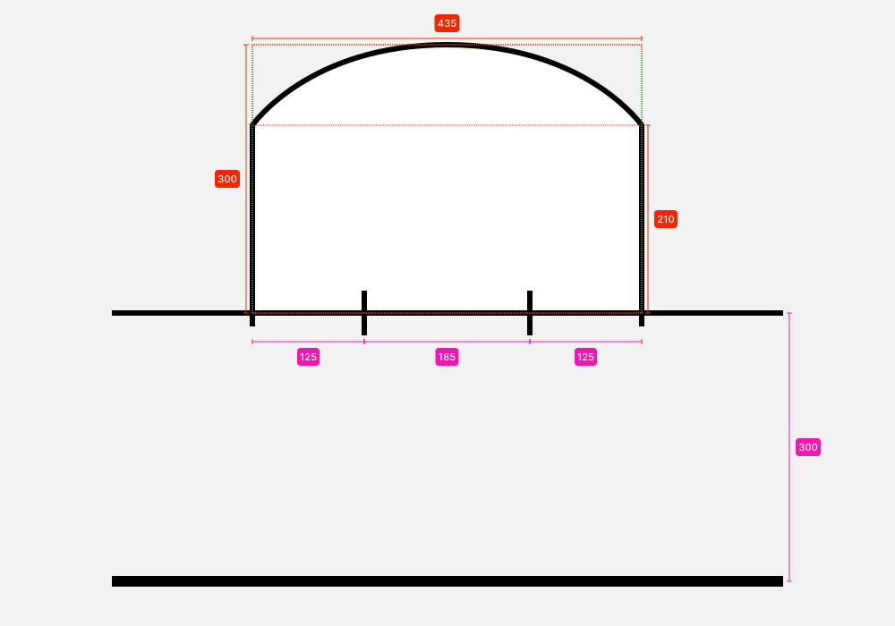
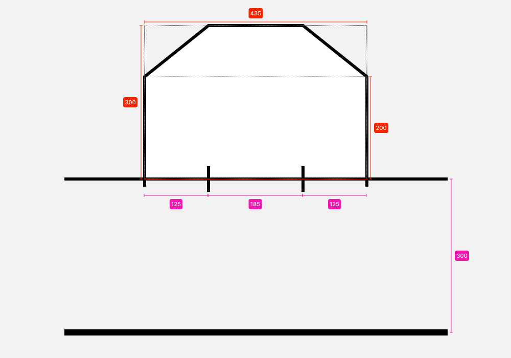

## EHBA: European Hardcourt Bikepolo Association

### Regolamento Ufficiale
##### Revisione EN: 200324\
Revisione IT: 240402

> Traduzione: Rayna (Napoli)\
> Revisione e mantenimento: Pyetro (Milano)

	⚠️ Alcune parole, frasi o concetti, sono nella maggior parte dei casi tradotte in Italiano, tranne quando la versione Inglese, oltre che essere più breve ed esaustiva rappresenta ormai un modo di dire consolidato a livello internazionale nel Bike Polo.

---

##### **Indice**

{{TOC}}

---

+++

# Squadre, Giocatori & Equipaggiamento [section1]

11. **Dimensione Squadra**
	111. **Formato 3v3**
		1111. Ci sono tre (3) giocatori per squadra.
	112. **Formato Squad**
		1121. Possono esserci da quattro (4) a sei (6) giocatori per squadra.
			11211. Una squadra può avere un massimo di cinque (5) giocatori disponibili in una partita.
				112111. I giocatori devono essere selezionati prima che la partita abbia inizio, la squadra deve comunicare la scelta dei giocatori agli Assistenti di Gioco prima dell'inizio della partita.

12. **Capitani delle squadre**
	121. Le squadre devono eleggere un giocatore come loro capitano durante la partita.
	122. Se il capitano della squadra viene espulso dal gioco, delegherà l'attività a un giocatore di sua scelta e informerà gli Assistenti di Gioco.
	123. I capitani delle squadre sono responsabili della trasmissione di tutte le comunicazioni dagli Ufficiali di Gara ai membri della loro squadra.
	124. I capitani delle squadre possono interagire con l'Arbitro durante le interruzioni riguardanti sostituzioni, controversie di penalità, equipaggiamento e altri casi di ragionevole dubbio.
		1241. Ai capitani delle squadre non è consentito interagire con l'Arbitro durante il gioco o dall'esterno del campo.
13. **Equipaggiamento‌**
	131. **Divise**
		1311. Le squadre devono indossare divise dello stesso colore, in contrasto con il colore della squadra avversaria.
		1312. Se richiesto dall'Arbitro, le squadre devono cambiare la divisa principale con la divisa alternativa prima dell'inizio della partita.
		1313. Se una squadra non ha una divisa alternativa, potrebbe venire richiesto di indossare una casacca colorata.
	132. **Equipaggiamento di sicurezza**
		1321. I giocatori devono indossare un casco sportivo omologato quando sono in campo.
		1322. Guanti, parastinchi e/o ginocchiere, gabbie per il viso e altri dispositivi di protezione non sono obbligatori ma sono raccomandati.
	133. **Mazze *(Mallets)***
		1331. **Asta *(Shaft)***
			13311. L'asta dev'essere fatta di un materiale resistente, che non si scheggi o che non sia suscettibile alla rottura durante quello che è considerato un gioco normale.
			13312. L'impugnatura dell'asta dev'essere tappata o sigillata.
			13313. L'asta non deve sporgere attraverso la parte inferiore della testa della mazza.
		1332. ***Testa della mazza* (Mallet Head)***
			13321. La testa della mazza dev'essere fatta di un materiale che non si frantuma, si spezza o si logora dando origine a un bordo tagliente.
			13322. La testa della mazza deve avere forma allungata e avere solo due (2) estremità.
			13323. La testa della mazza dev'essere fissata saldamente all'asta.
			13324. La lunghezza massima non può superare i `150 ± 1.0 mm`.
			13325. Il diametro esterno non può superare i `65 ± 0.5 mm`.
			13326. Il diametro interno qualsiasi foro nella testa del mallet non può superare i `58 ± 0.5 mm`.
		1333. **Impugnature**
			13331. La mazza deve avere un qualche tipo di impugnatura che permetta al giocatore di afferrare saldamente l'asta.
	134. **Biciclette**
		1341. Tutte le biciclette devono avere almeno un meccanismo di frenata manuale.
		1342. Il manubrio deve avere una lunghezza massima di `700 ± 10 mm`, includendo manopole e tappi.
			13421. Le estremità del manubrio devono essere tappate o chiuse.
		1343. Tutti i bordi taglienti devono essere rimossi o coperti.
			13431. I rotori dei freni a disco devono essere protetti.
			13432. Tutti i pignoni e le corone devono essere coperte dalla catena o protetti per non essere esposti.
			13433. Le fascette non devono essere tagliate o essere tagliate in maniera da non lasciare bordi taglienti.
			13434. Filettature sporgenti di bulloni e assi devono essere limitate o coperte.
			13435. Passacavi, innesti per v‐brake e qualunque altro accessorio affilato, saldato al telaio deve essere rimosso o coperto.
			13436. Tutte le parti coperte delle bici devono essere approvate dal Capo Arbitro.
		1344. Non possono esserci portapacchi, parafanghi, porta borraccia o qualunque altro accessorio che possa aiutare ad ostacolare il passaggio della palla.
			13441. Copri ruota, copri dischi e copri catena rotondi sono permessi. 

# Strutture di gioco [section2]

21. **Campo**
	211. **Dimensioni**
I campi non può essere più largo di `45 ± 0.5 m` per `25 ± 0.5 m` e più piccolo di `35 ± 0.5 m` per `18 ± 0.5 m`.
	212. **Sponde**
		2121. I campi devono essere delimitati da un perimetro solido tenuto saldamente insieme.
		2122. Le sponde sul perimetro devono essere alte almeno `1.2 ± 0.2 m`.
			21221. In caso di tavole più basse, l'arbitro può decidere di implementare regole aggiuntive riguardanti il contatto fisico e le palle fuori campo.
		21223. Non ci devono essere spazi vuoti nel perimetro che consentirebbero a una palla o a qualsiasi parte del corpo o dell'attrezzatura del giocatore di entrare.
	213. **Porte**
		2131. **Formato 3v3**
			21311. Ci deve essere almeno un (1) ingresso al campo.
				213111. Se sono disponibili due  (2) ingressi, devono essere simmetrici rispetto alla linea centrale del campo.
		2132. **Formato Squad**
			21321. Ci devono essere due (2) ingressi al campo, simmetrici rispetto alla linea centrale de campo.
			21322. Un arco sarà marcato a `3 ± 0.25 m` dal centro di ciascuna porta e verrà indicato come Area di Transizione dei giocatori.
	214. **Linee**
		2141. Tutte le linee devono avere uno spessore massimo di `5 cm`.
		2142. Il campo verrà segmentato su tutta la lunghezza in tre posizioni:\
			- metà campo, o *linea centrale;*\
			- entrambe le Linee di Porta.\
				21421. Verrà marcata la metà della linea centrale per posizionare la palla per le "contese" *(Joust).*
		2143. Le Linee di Porta devono essere parallele e a `3–4.5 m` di distanza dalle sponde del lato corto, a seconda delle dimensioni del campo.
			21431. Le Linee di Porta non possono essere distanti meno di `29 ± 0.5 m` l'una dall'altra.
		2144. Le Linee di Porta devono essere tracciate per posizionare lo Specchio della Porta, centrato rispetto alla larghezza del campo, definendo quello che verrà chiamata la Linea dello Specchio della Porta.
			21441. Lo Specchio della Porta deve essere delimitato da due (2) linee perpendicolari che si estendono di `10 ± 1 cm` verso il centro del campo e `20 ± 1 cm` dietro la porta.
			21442. Le due (2) linee verticali devono coincidere con le dimensioni delle porte usate, usando come riferimento l'interno dei pali.
	215. **Area di Tocco  *(Tap-In)***
		2151. Saranno tracciate due (2) linee sulle sponde di entrambi i lati del campo e saranno considerate come Aree di Tocco *(tap-in).*
		2152. Le linee verranno disegnate ad ogni lato a `0.75 ± 0.10 m` dalla linea centrale.
	216. **Area di Porta *(Crease)***
		2161. Verrà tracciata un'area davanti alla porta e verrà definita come *area di porta.*
		2162. La dimensione dell'Area di Porta deve essere un semicerchio di `3 ± 0.1 m` dal centro dell'apertura della porta, tagliato a `1.25 ± 0.1 m` dall'esterno di ciascun delimitatore dello Specchio della Porta. Vedi [`Diagramma 1`][diagram1].
			21621. L'Area di Porta può essere disegnata con linee rette, come nel [`Diagramma 2`][diagram2].
22. **Porte *(Goals)***
	221. Le Porte devono avere le reti.
	222. Le Porte devono avere una traversa rigida posizionata sopra la Linea di Porta.
	223. Le Porte sono posizionate in modo che lo Specchio della Porta sia uno di fronte all'altro, nelle posizioni marcate sulla Linea di Porta.
	224. Lo Specchio della Porta è largo `185 ± 5 cm`, misurato dall'interno dei pali.
	225. Lo Specchio della Porta è alto `90 ± 5 cm`, misurato dal suolo all'interno della traversa.
	226. La Porta è profonda `80 ± 15 cm`, misurata dal centro della Linea di Porta.
23. **Palle**
	231. Le Palle devono avere diametro di `67 ± 2 mm`.
	232. Le Palle devono pesare `70 ± 5 g`.
	233. Le Palle devono essere realizzate di un materiale a basso rimbalzo e resistente agli urti.
		2331. La durezza del materiale deve corrispondere alla sua temperatura di prestazione ottimale.

+++

### Diagramma 1: Area di porta [diagram1]

### Diagramma 2: Versione alternativa dell'area di porta [diagram2]

+++

# Ufficiali di Gara [section3]
31. **Ufficiali di Gara**
	311. Un torneo richiede un Capo Arbitro *(Head Referee)* designato dagli organizzatori dell'evento e comunicato ai giocatori all'inizio del torneo.
	312. Una partita ha bisogno dei seguenti Ufficiali di Gara:\
		- Arbitro *(Main Referee)*;\
		- Due (2) Giudici di Porta *(Goal Judges or Referees)*;\
		- Assistenti di Gioco *‌(Game Assistant)*;\
		- Assistente Arbitro *‌(Assistant Referee)*.			
			3121. Uno degli arbitri viene designato come Arbitro per dirigere la partita e viene comunicato a ciascuna squadra prima dell'inizio della partita.
			3122. I Giudici di Porta vengono nominati e approvati dall'Arbitro prima dell'inizio della partita.
				31221. I Giudici di Porta sono visivamente distinguibili dagli spettatori.
			3123. Gli Assistenti di Gioco non sono obbligatori, ma consigliati.
				31231. Nel caso in cui gli Assistenti di Gioco non siano disponibili l'Arbitro si assumerà le loro responsabilità e doveri.
32. **Attrezzatura**
	321. Gli organizzatori dell'evento devono fornire la seguente attrezzatura agli Ufficiali di Gara:\
		- orologio o cronometro;\
		- fischietto;\
		- tabellone;\
		- bandiere, cappelli o casacche (2) per i Giudici di Porta;\
		- penna e carta;\
		- adesivi "Bike Check", nastro adesivo o marcatori simili;\
		- casacche colorate per i giocatori.
33. **Posizionamento**
	331. **Arbitro**
		3311. L'Arbitro e gli Assistenti di Gioco devono essere posizionati a metà campo, con una visuale diretta, e non ostruita, del campo, preferibilmente dall'alto.
	332. **Assistenti di Gioco**
		3321. Gli Assistenti di Gioco devono essere posizionati vicino all'Arbitro a una distanza che renda agevole la comunicazione.
	3322. **Assistente Arbitro** 
		3323.  L'Assistente Arbitro può posizionarsi lungo il campo per aiutare a segnalare azioni difficili da vedere dall'Arbitro, altrimenti si posizionerà accanto all'Arbitro per seguire le azioni sulla palla e lontane dalla palla, in base alle esigenze del gioco.
	334. **Giudici di Porta**
		3341. I Giudici di Porta devono essere posizionati sul lato opposto dell'Arbitro, vicino alla *linea di porta* leggermente verso la metà campo, con una vista chiara e non ostacolata dello *specchio della porta,* preferibilmente dall'alto.
			33411. Nel caso in cui il posizionamento non sia disponibile, devono essere posizionati dietro o leggermente a lato della porta, a seconda di dove si ha una visione migliore dello Specchio della Porta. Il loro posizionamento deve essere approvato dall'Arbitro.
34. **Compiti**
	341. ***Capo Arbitro***
		3411. Il Capo Arbitro supervisiona la corretta applicazione del regolamento da parte degli altri Ufficiali di Gara.
			34111. Il Capo Arbitro non può annullare le decisioni prese dall'Arbitro durante una partita.
		3412.  Il Capo Arbitro deve fornire una copia aggiornata del regolamento come riferimento.
			34121. È responsabilità del Capo Arbitro spiegare il regolamento ai giocatori e agli altri Ufficiali di Gara.
		3413. Il Capo Arbitro ispeziona l'equipaggiamento dei giocatori prima dell'inizio dell'evento per determinarne la sicurezza e la conformità come da [`1.3`](#1.3).
			3414. Il Capo Arbitro può essere aiutato da altri Ufficiali di Gara per verificare l'attrezzatura.
		3414. Il punteggio finale delle partite perse a tavolino viene definito e annunciato dal Capo Arbitro prima dell'inizio del torneo.
	342. **Arbitro**
		3421. L'Arbitro mantiene il pieno controllo del gioco, applicando il regolamento al meglio delle proprie capacità.
			34211. È responsabilità dell'Arbitro valutare la gravità di tutte le infrazioni ed emettere qualsiasi penalità elencata nella [`Sezione 7`][section7] in modo tale da eliminare lo svantaggio competitivo.
		3422. L'Arbitro può ispezionare l'equipaggiamento dei giocatori prima della partita e procedere come da [`5.12`](#5.12) se l'equipaggiamento non è considerato sicuro.
		3423. L'Arbitro segnala l'inizio e la fine della partita come da [`5.1`](#5.1) e [`5.5`](#5.5).
		3424. L'Arbitro segnala tutte le interruzioni e le riprese del gioco come da [`5.3`](#5.3) e [`5.4`](#5.4).
		3425. L'Arbitro segnala tutte le infrazioni come da [`Sezione 6`][section6].
	343. **Giudici di Porta**
		3431. I Giudici di Porta devono segnalare i punti realizzati sul loro lato del campo come da [`3.5.2.1`](#3.5.2.1).
		3432. I Giudici di Porta dovrebbero segnalare ciò che percepiscono come una penalità nelle loro immediate vicinanze come da [`3.5.2.3`](#3.5.2.3).
			34321. I Giudici di Porta deve essere pronto a fornire una prospettiva all'Arbitro in merito a eventuali punti o penalità.
			34322. L'interazione con l'Arbitro è strettamente consultiva e la decisione finale spetta all'Arbitro.
		3433. I Giudici di Porta devono riposizionare le porte in caso vengano spostate o rovesciate durante il gioco.
			34331. Se il campo non consente l'accesso ai giudici di porta, l'Arbitro deve delegare questa responsabilità ad altri volontari.
			34332. Se non è disponibile l'accesso al campo, i giocatori vengono informati della responsabilità di riposizionare le porte.
		3434. I Giudici di Porta devono segnalare, come da [`3.5.2.3`](#3.5.2.3), false partenze durante la contesa (joust) come da [`5.2.1.1`](#5.2.1.1).
		3435. I Giudici di Porta possono segnalare un *Timeout* altrimenti non udito dall'Arbitro, dagli Assistenti di Gioco o dall'Assistente Arbitro.
	344. **Assistenti di Gioco**
		3441. L'Assistente di Gioco tiene il tempo della partita ed è responsabile dell'avvio e interruzione del cronometro ufficiale.
		3442. L'Assistente di Gioco tiene il tempo delle penalità assegnate ai giocatori quando sono temporaneamente esclusi dal gioco.
			34421. L'Assistente di Gioco ha la responsabilità di far sapere ai giocatori temporaneamente esclusi dal gioco quando possono rientrare. 
		3443. L'Assistente di Gioco compila e mantiene un registro di gioco *(Game Log)* cartaceo.
		3444. Il registro di gioco contiene le seguenti informazioni:\
			- i goal di ogni squadra;\
			- le penalità di ogni giocatore.
				34441. L'organizzatore dell'evento, in aggiunta, può richiedere anche:\
					- I tempi di tutti i goal e penalità chiamate;\
					- I nomi di chi segna i goal.
		3445. Se è presente un timer e un tabellone del punteggio visibile ai giocatori, l'Assistente di Gioco si occupa di far partire il tempo, fermarlo e aggiornare i goal sul tabellone.
		3446. L'Assistente di Gioco chiama ad alta voce il tempo di gioco rimanente, ad intervalli periodici e anche nelle seguenti situazioni:\
			- dopo i goal;\
			- a metà partità;\
			- ad ogni ripresa;\
			- due (2) minuti dalla fine;\
			- su richiesta dei giocatori.
				34461. Dopo aver chiamato due (2) minuti, l'Assistente di Gioco deve chiamare sessanta (60) secondi, trenta (30) secondi, dieci (10) secondi e un conto alla rovescia da cinque (5) secondi a uno (1).
	345. **Assistente Arbitro**
		3451. L'Assistente Arbitro può segnalare quello che ritiene una penalità secondo il punto [`3.5.3.1`](#3.5.3.1).
			3452. L'Assistente Arbitro dev'essere preparato a fornire una prospettiva all'Arbitro riguardo qualunque potenziale punto o penalità.
			3453. Le interazioni con l'Arbitro sono strettamente consultive, la chiamata finale dev'essere fatta dall'Arbitro.
		3452. L'Assistente Arbitro può segnalare un Timeout (come da [`3.5.3.2`](#3.5.3.2)) che non è stato sentito dall'Arbitro o dall'Assistente di Gioco.
35. **Segnali manuali**
	351. Arbitro 
		3511. Inizio del gioco—Alza il braccio in alto e lasciandolo cadere appena fischiato.
		3512. Ripresa del gioco—Stende un braccio in avanti con il palmo rivolto verso l'alto per indicare che il gioco può iniziare.
		3513. Penalità ritardata/Vantaggio—Solleva il braccio esteso verso l'alto.
		3514. Possesso dopo un'interruzione—Tende un braccio in direzione della squadra che riprenderà il gioco con la palla.
	352. Giudici di Porta
		3521. Goal segnato—Solleva il braccio esteso verso l'alto.
			35211. Alza la bandiera, se è disponibile.
		3522. Tiro mancato/Goal non valido—Incrocia le braccia in avanti e le apre verso l'esterno con un movimento ampio.
		3523. Falsa Partenza/Infrazione—Alza un braccio in alto e con l'altro indica il giocatore che ha commesso l'infrazione.
			35231. Se è disponibile una bandiera, il Giudice di Porta la alza estendendo l'altro braccio.
		3524. Timeout—Mima una "T" con entrambe le braccia.
	353. **Assistente Arbitro**
		3531. Infrazione—Alza un braccio e con l'altro indica il giocatore che ha commesso l'infrazione.
		3532. Timeout—Mima una "T" con entrambe le braccia.

# Giocare la palla [section4]
41. **Possesso di palla**
	411.  Il giocatore che ha eseguito intenzionalmente l'ultimo tocco controllato del mallet sulla palla è considerato in possesso di palla. Il giocatore in possesso è noto come Portatore di Palla.
		4111. Un giocatore non è considerato in possesso della palla, o il possesso viene ceduto nei seguenti casi:\
				- La palla si muove a circa 3 metri di distanza dal Portatore di Palla;\
				- La palla si muove così velocemente in prossimità di un giocatore che non è in grado di eseguire più di un (1) tocco controllato sulla palla libera;\
				- Il Portatore di Palla non è più in grado di giocare la palla con la mazza;
		4112. Il possesso non è perso dal Portatore di Palla se un tocco intenzionale sulla palla da parte di un avversario, non ostacola l'abilità del Portatore di continuare a giocare la palla con il mallet e la palla resta in prossimità di circa tre (3) metri.
42. **Tiro**
	421. Un tiro viene definito come un urto elastico tra uno dei lati terminali della testa della mazza e la palla.
	422. Direzionare intenzionalmente la palla per mezzo di un contatto con qualunque parte del corpo o della bici non è un tiro.
	423. Uno "shuffle", "ball‐joint", "scoop" o "trasporto", come da [`4.3`](#4.3) fino a [`4.6`](#4.6), non viene considerato un tiro.
	424. Qualunque contatto con la stecca della mazza non è un tiro.
	425. Una palla deviata da una superficie o equipaggiamento che viene da un'azione che non è stata un tiro non è considerata un tiro.
43. **Shuffling**
	431. Viene definito "Shuffle" qualunque contatto tra la parte allungata della testa della mazza e la palla.
44. **‌Ball–Jointing**
	441. Viene definito "Ball–Jointing" la pressione applicata sulla palla usando qualunque foro o superficie concava della testa della mazza allo scopo di incastrarla contro una qualsiasi superficie del campo.
	442. Il "Ball–Jointing" è permesso in qualunque punto del campo per un tempo limitato di due (2) secondi.
45. **Cucchiaio *(Scooping)***
	451. Viene definito "Scoop" il manovrare la palla a coppa in un buco della testa della mazza usando la forza centripeta per mantenere la palla nel buco.
	452. Lo "Scoop" è permesso al di sotto dell'altezza del manubrio del giocatore o dell'avversario se questo è vicino approssimativamente 3m come in [`6.4.3.3`](#6.4.3.3). 
	453. Lo "Scoop" è permesso per non più di tre (3) cambi di direzione.
46. **Trasporto *(Carrying)***
	461. Viene definito "Carrying" portare la palla con la testa della mazza, grazie alla forza di gravità che tiene la palla derma nella testa.
	462. Il "Carrying" non è permesso.
47. **Afferrare *(Grabbing)***
	471. Viene definito "Grabbing" usare la mano per afferrare la palla.
	472. il "Grabbing" non è permesso.
		4721. Un giocatore può usare entrambe le mani per fermare una palla volante ma deve immediatamente deviare la palla verso il pavimento nel punto in cui è stata fermata.
48. **Slapping**
	481. Reindirizzare intenzionalmente o dare impulso alla palla con le mani o i piedi è considerato "Slapping".
	482. Lo "Slapping" non è permesso.
		4821. Un giocatore difensivo all'interno della propria area di porta può usare le mani per reindirizzare, senza afferrare, una palla volante sotto l'altezza delle spalle.

# Meccanismi di Gioco
51. **Inizio del gioco**
	511. Le squadre si preparano per la giostra (*Joust*) come da [`5.2`](#5.2).
	512. L'Arbitro chiede ad ogni squadra se è pronta. Il capitano di ogni squadra deve dare una chiara conferma o declinazione verbale.
		5121. I capitani delle squadre possono confermare alzando la mano o declinare estendendo la mano rivolta verso l'esterno e ondeggiandola da un parte all'altra.
	513. Quando entrambe le squadre confermano di essere pronte, l'Arbitro alza le mani e fischia mentre lascia cadere la mano per segnalare l'inizio.
		5131. L'Assistente di Gioco fa partire il tempo al fischio.
		5132. Le squadre possono gareggiare per il possesso di palla.
52. **La Giostra (*Joust*)**
	521. Ogni squadra si posiziona nel proprio lato del campo; i giocatori stazionano sulle biciclette con la ruota posteriore che tocca la sponda alle spalle della porta.
		5211.  Si ha una Falsa Partenza quando un giocatore lascia la sponda prima del fischio di inizio del gioco.
			52111. Il Giudice di Porta deve segnalare una Falsa Partenza, come da [`3.5.2.3`](#3.5.2.3), se qualunque giocatore lascia la sponda prima del fischio di inizio.
			52112. Un vantaggio della squadra che ha commesso la Falsa Partenza si convertirà in una penalità e il possesso di palla è concesso alla squadra che ha perso la Giostra.
	522. I giocatori che partono alla Giostra devono tenere la mazza sullo stesso lato della bici.
		5221. Di solito, alla giostra partecipano giocatori destri.
		5222. Le squadre possono accordarsi per una Giostra mancina, informando l'Arbitro prima dell'inizio del gioco.
			52221. In caso di disaccordo, il lato della giostra sarà determinato da quello nella quale la maggioranza dei giocatori tiene la mazza.
		5223. In una Giostra di destri, i giocatori devono correre sul lato sinistro del loro avversario quando si incontrano e sorpassano. In una Giostra di mancini, i giocatori devono correre sul lato destro del loro avversario.
	523. Solo un (1) giocatore per squadra correre durante Giostra.
		5231. I giocatori che corrono nella Giostra devono mantenere direzione retta fino a quando uno dei giocatori entra in contatto con la palla.
		5232. Qualunque giocatore che corre verso la palla con un ritmo costante viene considerato un partecipante alla Giostra.
			52321. I giocatori che corrono nella Giostra, non possono smettere di correre una volta che sono a circa 3 metri dalla palla.
		5233. Tutti gli altri giocatori non possono gareggiare per il possesso di palla o posizionarsi nella traiettoria di un giocatore che concorre nella Giostra, almeno fino a quando il possesso non è stabilito o entrambi i giocatori in corsa nella Giostra superano la palla, non riuscendo a guadagnarsi il possesso di palla.
53. **Interruzione del Gioco**
	531. L'Arbitro segnala l'interruzione del gioco fischiando.
		5311. Una volta che l'Arbitro segnala l'interruzione, il gioco deve fermarsi indipendentemente dalle circostanze.
	532. Il gioco può essere interrotto per una delle seguenti ragioni:\
		- goal;\
		- penalità;\
		- palla fuori campo;\
		- infortunio;\
		- porta fuori sede;\
		- time-out;\
		- equipaggiamento non sicuro.
	533. Le squadre devono smettere di giocare e tornare nella propria metà campo entro dieci (10) secondi dal fischio.
	534. **Formato 3v3**
		5341. L'Assistente di Gioco deve fermare il tempo ad ogni interruzione del gioco.
	535. **Formato a Squadra**
		5351. Il cronometro non viene fermato se non in caso di:\
			- infortunio;\
			- time-out.
				53511. Durante gli ultimi due (2) minuti della partita, l'Assistente di Gioco ferma il tempo ad ogni interruzione del gioco.	
54. **Ripresa del Gioco**
	541. L'Arbitro sollecita una conferma visiva o verbale alla squadra senza il possesso di palla se pronta a riprendere il gioco.
		5411. L'Arbitro può fischiare velocemente due volte per sollecitare la conferma della squadra.
		5412. In caso la squadra senza possesso di palla non comunica di essere pronta entro dieci (10) secondi viene assegnata una Penalità di Ritardo come da [`6.1.1`](#6.1.1).
	542. Dopo la conferma, l'Arbitro indica che il gioco riparte come da [`3.5.1.2`](#3.5.1.2) e annuncia “10 secondi per oltrepassare la metà campo”.
		5421.  Se la squadra in possesso di palla non inizia a giocare entro dieci (10) secondi da quando l'altra squadra ha confermato di essere pronta, il team senza il possesso di palla può iniziare a giocare superando la metà campo.
			54211. L'arbitro segnala verbalmente “gioco” ("game on"). 
			54212. L'Assistente Arbitro fa ripartire il tempo.
	543.  Il gioco inizia e il tempo riparte quando la palla o un giocatore della squadra con il possesso della palla, supera la metà campo.
		5431. L'Arbitro indica l'inizio del tempo annunciando “gioco” ("game on").
		5432. I giocatori della squadra senza il possesso palla non possono attaccare l'altra squadra prima che inizi il gioco.
55. **Fine del Gioco**
	551. I'orologio ufficiale di gioco indica la fine della partita.
	552. L'Arbitro segnala la fine del gioco con due fischi lunghi.
56. **Punteggio**
	561. **Goal**
		5611. Si guadagna un punto quando la palla attraversa completamente la Linea dello Specchio della Porta avendo avuto origine da un tiro, come definito in [`4.2`](#4.2).
			56111. Un tiro può deviare su una qualunque superficie, ad eccezione del lato lungo della testa della mazza e della stecca della mazza di un giocatore in attacco, prima di attraversare la linea di porta ed essere considerato valido.
		5612.  Il Giudice di Porta segnala un goal come da [`3.5.2.1`](#3.5.2.1). e il gioco riparte come da [`5.4`](#5.4).
	562. **Goal non validi**
		5621. Non viene assegnato un punto nel caso in cui la palla attraversa la Linea dello Specchio della Porta per mezzo di un'azione di un giocatore in attacco che non è stata un tiro.
		5622. Non viene assegnato punto nelle seguenti situazioni:\
			- Qualunque palla che superi la Linea dello Specchio della Porta dopo un fischio.\
			- Qualunque azione sulla palla che avvenga prima che il gioco abbia inizio come da [`5.4.3`](#5.4.3)\
			- Un giocatore in attacco commette un'infrazione prima che il tiro superi la Linea dello Specchio della Porta.
		5623. Il Giudice di Porta segnala un goal non valido come indicato in [`3.5.2.2`](#3.5.2.2).
		5624. La squadra in attacco perde il possesso di palla e il gioco ricomincia come da [`5.4`](#5.4).
	563. **Autogoal**
		5631. Viene assegnato un punto alla squadra avversaria quando una qualsiasi azione sulla palla da parte di un giocatore fa sì che l'intera palla attraversi la Linea dello Specchio della Porta della porta difesa.
		5632. Il Giudice di Porta segnala un autogoal come da [`3.5.2.1`](#3.5.2.1) e il gioco riprende come da [`5.4`](#5.4).
57. **Palla Fuori Gioco**
	571. **Fuori Campo**
		5711. La palla è fuori gioco quando lascia il campo o rimbalza su qualunque oggetto al di sopra delle sponde.
			57111. Il possesso di palla è perso dalla squadra che ha toccato per ultima la palla, incluse deviazioni sul corpo o sulla bici di un giocatore.
	572. **Palla Bloccata**
		5721. Una palla è considerata bloccata quando è incastrata, intrappolata oppure bloccata nell'equipaggiamento di un giocatore o in una struttura del campo.
			57211. Il possesso di palla è perso dalla squadra che ha la palla incastrata nel proprio equipaggiamento.
			57212. Il possesso viene perso dalla squadra che ha toccato per ultimo la palla, incluse le deviazioni sul copro o sulla bici di un giocatore, quando la palla resta bloccata in una struttura del campo.
58. **Infortuni**
	581. L'interruzione del gioco per l'infortunio di un giocatore è chiamato a discrezione dell'Arbitro, che determina se un giocatore necessita di attenzione immediate.
		5811. Non c'è un limite di tempo definito all'interruzione di gioco in caso di infortunio.
		5812. I giocatori non sono tenuti a tornare nella propria metà campo come da [`5.3.3`](#5.3.3) se interessati alla sicurezza o il benessere di un giocatore, nel caso possano assistere il giocatore infortunato.
		582. Il possesso di palla ritorna alla squadra che ne aveva possesso al momento dell'interruzione a meno che non venga assegnata una penalità *dall'Arbitro* Principale.
		583. Il gioco riprende come da [`5.4`](#5.4) a seguito del recupero del giocatore infortunato o l'entrata in campo di un giocatore sostitutivo come da [`5.9`](#5.9).
59. **Sostituzione di un giocatore**
	591. **Formato 3v3**
		5911. Una squadra può chiedere all'Arbitro la sostituzione di un giocatore in caso di infortunio o in altre circostanze eccezionali, durante il corso del gioco o tra le partire.
	592. **Formato Squad**
		5921. Una squadra non può sostituire nessun giocatore durante una partita.
		5922. Una squadra non può chiedere all'Arbitro la sostituzione di un giocatore finché la squadra ha meno di quattro (4) giocatori non infortunati che possono giocare.
	593. **Procedura generale per la sostituzione**
		5931. I giocatori sostituiti perdono la possibilità di essere scelti per giocare in qualunque altra squadra durante un torneo.
		5932.  Gli unici giocatori eleggibili per la sostituzione sono quelli che non sono entrati nel torneo, oppure giocatori che sono già stati eliminati prima della fase o girone di eliminazione in corso.
		5933.  Un giocatore sostituito può essere sostituita solo dal membro originario della squadra oppure in caso di un successivo infortunio.
			59331. Se un giocatore originale si riunisca alla squadra dopo una sostituzione, la squadra perde la possibilità di una sostituzione secondaria per quel giocatore.
			59332. In caso di ulteriori infortuni o inabilità del giocatore a continuare portano la squadra a proseguire senza il giocatore per il resto del torneo.
		5934. Alla squadra viene concessa una ragionevole quantità di tempo (non superiore ai 5 minuti) per trovare un rimpiazzo che venga approvato dal Capo Arbitro.
		5935. Se un giocatore viene espulso dal torneo la sua squadra può richiedere un sostituto solo dopo la partita in cui è avvenuta l'espulsione.
510. **Timeout**
	5101. Ad ogni squadra sono concessi due (2) Timeout di durata massima di due minuti ciascuno.
		51011. I Timeout possono essere richiesti consecutivamente, se necessario.
			510111. Una squadra che non è pronta a giocare nei dieci (10) secondi di tempo limite dopo i due (2) minuti di pausa del primo Timeout deve richiedere, se disponibile, il secondo Timeout per estendere l'interruzione di gioco.
	5102. Durante qualsiasi interruzione di gioco, ogni squadra può chiamare un Timeout per allungare il limite di dieci (10) secondi prima che il  gioco riprenda.
		51021. La squadra con possesso di palla, non ne perde possesso quando il gioco riprende.
	5103. Nel corso dell'azione di gioco, una squadra può chiedere un'interruzione di gioco guadagnando il possesso e chiamando ad alta-voce “Timeout” rivolgendosi all'Arbitro.
		51031. La squadra che ha chiamato il Timeout perde il possesso di palla,
			510311. I Timeout richiesti durante l'azione di gioco dovuti a una palla rotta o all'infortunio di un giocatore che ha bisogno di attenzioni mediche immediate, porta la squadra a mantenere il possesso di palla alla ripresa del gioco e non influenza il numero di Timeout disponibili.
		51032.  I Giudici di Porta e l'Assistente Arbitro possono segnalare la richiesta di Timeout all'Arbitro come da [`3.5.2.4`](#3.5.2.4).
	5104. Alla scadenza del Timeout o quando la squadra che l'ha richiesto si dichiara pronta, il gioco può ricominciare come da [`5.4`](#5.4).
	5105. **Formato 3v3**
		51051. In caso di problemi meccanici che richiedono la riparazione della bici o dell'attrezzatura di un giocatore, causati dalla squadra avversaria, possono essere concessi 5 minuti di pausa dall'Arbitro.
			510511. Questo Timeout non influenza il numero di Timeout disponibili della squadra.
			510512. La squadra può allungare la pausa con i propri Timeout disponibili se necessario.
			510513. La squadra che ha diritto al possesso di palla quando il gioco riprende, non cede il possesso all'avversario.
	5106. **Formato Squad**
		51061. I problemi meccanici, che richiedono la riparazione della bici o dell'attrezzatura di un giocatore, comporta la sostituzione del giocatore con un altro membro della sua squadra senza interruzione del gioco come da [`5.13`](#5.13).
511. **Posizione sbagliata della porta**
	5111. Se la porta cambia posizione, la Linea di Porta come definita in [`2.1.4.4`](#2.1.4.4) resta la soglia che la palla deve oltrepassare perché un punto venga assegnato.
		51111. L'Arbitro può assegnare un punto a una squadra, per un tiro deviato da una porta spostata che altrimenti avrebbe oltrepassato la Linea di Porta.
	5112. L'Arbitro può fermare il gioco se la posizione della porta si è spostata tanto da impedire al Giudice di Porta di determinare se un punto è stato segnato o se è evidente che la posizione della porta spostata influisce lo svolgimento del gioco.
	5113. La porta spostata dalla sua posizione originale, a causa di una circostanza non intenzionale non comporta una penalità.
	5114. Il possesso di palla viene mantenuto dalla squadra che lo aveva prima dell'interruzione del gioco.
		51141. Se nessun team aveva possesso di palla al momento dell'interruzione, il gioco riprende con una Giostra come da [`5.2`](#5.2).
	5115. Quando la porta viene rimessa nella posizione corretta dal Giudice di Porta come da [`3.4.3.3`](#3.4.3.3) senza interferire con il gioco, non richiede interruzione del gioco.
		51151. Un difensore nella propria Area di Porta può portare la porta leggermente spostata, nella sua posizione corretta se l'operazione non interferisce in alcun modo lo svolgimento del gioco.
512. **Attrezzatura non sicura**
	5121. L'Arbitro può interrompere il gioco se ad un certo punto di una partita ritiene che l'equipaggiamento di un giocatore non sia sicuro.
	5122. La squadra deve ricorrere ai propri Timeout disponibili, per risolvere il problema o sostituire la bici.
		51221. Se il problema non può essere risolto o una bici sostitutiva non è disponibile nel tempo concesso, il gioco riprenderà senza il giocatore in questione quindi con un Vantaggio del Giocatore per la squadra avversaria.
		51222. Il giocatore escluso può essere reintegrato in partita alla successiva interruzione di gioco.
	5123. L'Arbitro può concedere cinque (5) minuti di Timeout per risolvere i problemi dovuti a fattori esterni come nel caso di uno scontro.
	5124. L'Arbitro deve approvare l'attrezzatura del giocatore in questione prima di della ripresa del gioco.
		51241. Nel caso in cui l'attrezzatura non sia ritenuto sicura dall'Arbitro, il giocatore sarà escluso dal gioco fino alla risoluzione del problema.
513. **Meccanismi di panchina (Formato Squad)** 
	5131. La squadra può sostituire qualunque giocatore in panchina con uno dei 3 giocatori in campo, entrando e uscendo attraverso un ingresso, situato nella metà difensiva del campo.
	5132. Prima che un nuovo giocatore entri in campo, il giocatore che sta tentando l'uscita dal campo deve essere nell'Area di Transizione, delimitata a `3 ± 0.5 m` dal centro dell'ingresso assegnato alla sua squadra.
		51321. Se un giocatore che entra o esce dal campo, interferisce con una palla libera o con un portatore di palla avversario durante la sostituzione, viene chiamata un'infrazione di Sostituzione Illegale come da [`6.1.5`](#6.1.5).

# Infrazioni [section6]
61. **Infrazioni Tecniche**
	611. **Ritardo di Gioco**
		6111. Una squadra ostacola la ripresa del gioco come da [`5.4`](#5.4).
			61111. Un'Infrazione Personale viene automaticamente assegnato al capitano della squadra alla prima infrazione.
			61112. Qualsiasi infrazione successiva viene assegnata una Penalità Minore al capitano della squadra.
		6112. Un giocatore blocca la pallina con la mazza o la bici mentre è appoggiato contro le sponde, impedendo agli altri giocatori di giocare la palla.
		6113. Un giocatore fa uscire la palla dal gioco raccogliendola con il lato cavo della testa (*Scooping*) o tirandola fuori dal gioco di proposito.
		6114. Un giocatore sposta di proposito la posizione della porta come da [`5.11`](#5.11).
	612. **Comportamento Antisportivo**
		6121. Il comportamento di un giocatore viene considerato antisportivo secondo, ma non limitato a, i seguenti criteri:\
			- Generali e continuative interruzioni delle procedure di gioco;\
			- Eccessive proteste contro gli ufficiali di gioco;\
			- Essere attivamente coinvolto nel gioco dopo in'Infrazione di Piede (*Dabbing*);\
			- Incapacità di uscire dopo un'Infrazione di Piede (*Dabbing*), che comporta un vantaggio per la propria squadra;\
			- Interagire o impedire ad un giocatore che ha appena commesso un'Infrazione di Piede (*Dubbed*) o rendendo la sua attrezzatura più difficile da recuperare;\
			- Creare un vantaggio ingiusto alla propria squadra.
				61211. Spostare una mazza caduta a un giocatore che ha commesso un'Infrazione di Piede, che interferisce al gioco, non comporta un'infrazione da comportamento antisportivo come nel punto [`6.4.8.2.2`](#6.4.8.2.2).
		6122. L'infrazione da comportamento antisportivo comporta una Penalità Minore, Maggiore o di Cattiva Condotta.
			61221. Un giocatore coinvolto in aggressioni verbali o fisiche rivolte a Ufficiali di Gioco, organizzatori dell'evento, spettatori o altri giocatori, porterà automaticamente all'assegnazione di una Penalità di Cattiva Condotta.
	613. **Interferenza**
		6131. **Interferenza con la Bici**
			61311. Interferenza con la bici, "schermatura/ostruzione" (*screening*) o "blocco" viene definito come un utilizzo attivo del movimento e della posizione della bici per bloccare bruscamente e/o continuamente un avversario non in possesso da:\
				- Guadagnare una posizione difensiva o offensiva nel campo.\
				- Avere accesso diretto a una palla libera.\
				- Affrontare un giocatore in possesso di palla.
					613111. Un'infrazione per interferenza della bici viene chiamata quando un giocatore che non è in possesso di palla, scherma un avversario che non ha possesso di palla.
			61312. Tutti i giocatori non in possesso di palla hanno diritto allo spazio che occupano.
				613121. La penalità non viene assegnate se un giocatore sta occupando il suo spazio da fermo o è in movimento ad una velocità prevedibile e costante nel prendere posizione offensiva o difensiva nel campo.
				613122. Uno stazionamento o una momentanea ostruzione non comporta una penalità se l'azione incrocia accidentalmente la posizione del giocatore avversario.
				613123. L'impedenza naturale di un avversario dovuta alla posizione e alla velocità non comporta una penalità.
			61313. Quando si concorre per una palla libera, tutti i giocatori che gareggiano per il possesso devono muoversi direttamente e naturalmente verso la palla o concederla.
				613131. La penalità non viene assegnata se il giocatore più vicino a una palla libera "scherma" gli avversari entro approssimativamente `3 m` per guadagnare la palla in sicurezza.
				613132. Una penalità per interferenza della bici viene assegnata se un giocatore che gareggia per il possesso ostruisce un avversario concedendo a un proprio compagno di squadra il possesso di palla.
			61314. Un giocatore che non ha possesso di palla ha diritto di tentare di schermare il portatore di palla.
				613141. Se un giocatore in possesso di palla, la passa o la perde non può più essere ostruito.
		6132. **Interferenza Fisica**
			61321. L'infrazione di interferenza fisica viene assegnata se un giocatore dà inizio a un contatto fisico con un avversario senza possesso di palla.
				613211. I giocatori che gareggiano per il possesso di una palla libera possono ingaggiarsi fisicamente come da [`6.3`](#6.3) entro `3 m` dalla palla.
		6133. Interferenza della mazza
			61331. L'infrazione per interferenza della mazza viene assegnata quando un giocatore usa la propria mazza per iniziare o continuare un contatto con la mazza di un giocatore avversario che non ha possesso di palla o gli impedisce di muoversi liberamente.
				613331. Il contatto mazza-mazza è permesso quando si gareggia per una palla libera nel raggio di `3 m` dalla palla.
				613332. Un giocatore che usa la propria mazza per iniziare un contatto con la mazza di un giocatore avversario, per concedere il possesso a un difensore all'interno dell'Area di Porta, non sarà punito con una penalità di interferenza della mazza.
	614. **Violazione dell'area di porta (*crease*)**
		6141. É permesso a un solo difensore di stare nell'Area di Porta per più di tre (3) secondi prima che vi faccia ingresso la palla o il portatore di palla.
			61411. Una penalità di violazione dell'Area di Porta viene assegnata a qualunque difensore aggiuntivo o qualunque giocatore attacante che si trovi nell'Area di Porta per più di tre (3) secondi prima dell'ingresso della palla o del portatore di palla.
		6142. Nel momento in cui la palla o il portatore di palla entrano nell'Area di Porta, i giocatori possono entrare a loro volta per fare un gioco leale sulla palla.
		6143. Quando la palla esce dall'Area di Porta, tutti i giocatori eccetto un (1) difensore, devono uscire entro il limite di 3 secondi.
			61431. Se un giocatore usa la bici, il corpo o la mazza per impedire a un avversario di uscire dall'Area di Porta entro il limite di tre (3) secondi, il giocatore che resta in area non riceve nessuna penalità.
		6144. Se viene commessa una Violazione dell'Area di Porta mentre un avversario non ha la possibilità di segnare, si esegue un cambio palla solo alla prima occorrenza dell'infrazione.
			61441. La successiva violazione porterà a una Penalità Minore indipendentemente da quale giocatore della squadra abbia commesso l'infrazione.
		6145. Se la violazione viene commessa mentre un avversario ha un'evidente possibilità di segnare punto con un tiro, un passaggio o una palla libera o perché vicino all'Area di Porta, verrà assegnata una Penalità Minore immediatamente, anche alla prima occorrenza dell'infrazione.
			61451. Successive infrazioni commesse mentre un avversario ha un'evidente possibilità di segnare punto con un tiro, un passaggio o una palla libera o perché vicino all'Area di Porta, la penalità si trasforma in una Penalità Maggiore indipendentemente da quale sia il giocatore a commettere l'infrazione.
	615. **Sostituzione Illegale (Formato Squad)**
		6151. Un giocatore che sta uscendo dal campo deve avere almeno una ruota nell'Area di Transizione intorno all'ingresso designato alla squadra, prima che il giocatore in ingresso possa superare la soglia del campo.
		6152. Durante una sostituzione, i giocatori nell'Area di Transizione non possono interferire attivamente con la palla o un giocatore avversario.
			61521. Viene assegnata una Penalità Minore di Sostituzione Illegale, al giocatore che interferisce attivamente con la palla o un avversario dall'interno dell'Area di Transizione, durante la sostituzione.
		6153. Una palla libera che entra in contatto con un giocatore ma che non viene direzionata intenzionalmente, non porterà a una Penalità di Sostituzione Illegale, indipendentemente da quale giocatore la colpisce o se entrambi i giocatori sono in campo.
		6154. Più di tre (3) giocatori della stessa squadra in campo, attivamente coinvolti nel gioco porterà a una Penalità Maggiore al giocatore entrato per ultimo in campo.
			61541. La squadra penalizzata deve selezionare un altro giocatore in campo che dovrà sedere in panchina per la durata del Vantaggio del Giocatore.
62. **Infrazione di gestione della bici**
	621. ***Dabbing* (Piede/Tocco)**
		6211. Un giocatore è considerato *Dabbed* quando i suoi piedi si appoggiano su qualsiasi cosa che non sia la sua stessa bici o la parete verticale delle sponde del campo.
			62111. I piedi dei giocatori non devono toccare il pavimento, la porta o il corpo o l'attrezzatura di un altro giocatore.
		6212. Un giocatore che si appoggia con una parte del corpo contro la porta per stabilizzarsi è considerato un giocatore *Dubbed*.
			62121. Il Giudice di Porta può segnalare un *Dab* come da [`3.5.2.3`](#3.5.2.3).
			62122. L'Arbitro o il Giudice di Porta annuncia al giocatore il *Dab*.
		6213. La mano di un giocatore non deve afferrare nient'altro che la sua bici, la mazza o la palla come da [`4.7`](#4.7).
		6214. Trattenere, aggrapparsi o appoggiarsi sulla porta o sul bordo superiore delle sponde è considerato *Dab*.
			62141. Riposizionare la porta come da [`5.11.5.1`](#5.11.5.1) non è considerato *Dab*.
		6215. Un giocatore che ha commesso *Dab* è considerato fuori dal gioco e non può interferire col gioco usando la bici, il corpo o la mazza per impedire a un avversario di giocare la palla o sul portatore di palla.
		6216. Un giocatore che ha commesso *Dab* non può essere coinvolto nel gioco o schermato.
			62161. L'Arbitro assegna una Penalità per Comportamento Antisportivo come da [`6.1.2.1`](#6.1.2.1).
		6217. Un giocatore che ha commesso *Dab* deve andare a battere la mazza sulle sponde del campo in una delle nelle aree *Tap-In* designate.
		6218. Al giocatore che ha commesso *Dab* è concesso un tempo ragionevole per ritirarsi dall'area di gioco.
			62181. L'arbitro può assegnare una penalità se il giocatore che ha commesso *Dab* interferisce con il gioco creando un vantaggio per la propria squadra.
			62182. Se il giocatore che ha commesso *Dab* blocca un tiro alla sua porta che diversamente avrebbe attraversato la Linea di Porta, l'Arbitro assegna il punto alla squadra del giocatore che ha tirato come da [`7.5.1`](#7.5.1).
	622. ***Toppling* (Sbilanciamento)**
		6221. Viene chiamato un *Toppling* quando un giocatore commette *Dab* che è anche la causa del *Dab* o di uno incidente durante un contatto con uno o più avversari.
		6222. Viene assegnata una Penalità di Toppling a un giocatore che nel perdere l'equilibrio fà commettere *Dab* o scontrare uno o più avversari ma riacquista l'equilibrio attraverso il contatto con il giocatore a cui ha fatto commettere *Dab*.
	623. **Contatto tra bici**
		6231. Un giocatore che usa, accelera o manovra la bici per iniziare un contatto con l'avversario o l'attrezzatura dell'avversario commette un'infrazione di Contatto con la bici.
			62311. Un'infrazione Contatto *T-Bone* (chiusura a T) viene chiamata quando un giocatore inizia un contatto con un avversario, andando con impeto con la ruota o il pedale contro l'avversario nella direzione verso cui sta viaggiando.
			62312. Un'infrazione di Contatto *Slapping* (schiaffeggiare) quando un giocatore inizia un contatto con un avversario sgommando o ruotando (*pivot*) una delle ruote della sua bici nell'avversario lateralmente o in rotazione.
			62313. Un'infrazione di *Sweeping* (spazzata) viene chiamata quando un giocatore usa la ruota anteriore o posteriore per iniziare un contatto con la mazza ferma e puntata a terra, di un giocatore.
			62314. Un'infrazione di *Pedaling* (pedalata) si ha se due giocatori sono fermi a stretto contatto e uno dei due usa un pedale per iniziare un contatto con un avversario o la sua attrezzatura.
		6232. Il contatto bici–bici viene considerato accidentale quando due giocatori si toccano mentre entrambi sono in corsa per il possesso della palla senza  compromette il gioco e senza pericolo.
			62321. Nessuna penalità viene assegnata quando il contatto tra bici è ritenuto accidentale.
		6233. É a discrezione dell'Arbitro chiamare le Penalità di Contatto tra bici per quelle infrazioni che non sono esplicitamente descritte ma dove il contatto tra bici causa un *Dab* o impedisce ragionevolmente il libero movimento sul campo.
63. **Infrazioni di Contatto Fisico**
	631. **Estensione (*Extension*)**
		6311. L'infrazione di Estensione viene chiamata quando un giocatore allunga il braccio, il gomito, l'avambraccio o la mano per iniziare un contatto con un altro giocatore o lo spinge a contatto già avvenuto.
			63111. Il contatto fisico principale deve avvenire con la spalla quando si affronta un avversario.
			63112. Un giocatore può piegare il braccio vicino al corpo durante l'inizio e la fine del contatto.
			63113. L'infrazione di estensione viene chiamata solo quando un giocatore estende il braccio verso l'alto o all'esterno della spalla per entrare in contatto o sganciarsi da un avversario in modo da spingerlo, puntandosi (infilzandolo) o colpendolo.
	632. **Carica (*Charging*)**
		6321. Un giocatore che inizia un contatto con un avversario, ha la responsabilità di affrontarlo “ad armi pari”.
			63211. Il contatto con la parte bassa della schiena, i reni o le costole, o il contatto impetuoso da dietro verso un avversari, comporta l'assegnazione di un'infrazione di Carica.
	633. **Trattenuta (*Holding*)**
		6331. L'infrazione di Trattenuta viene assegnata quando un giocatore impedisce fisicamente il movimento di un avversario trattenendo la sua mazza, il corpo o la bici.
	634. **Calciare (*Kicking*)**
		6341. L'infrazione di Calciare comporta l'assegnazione di una Penalità Minore quando un giocatore calcia il corpo di un avversario, l'attrezzatura o la palla.
	635. **Contatto di Testa (*Head Contact*)**
		6351. L'infrazione di Contatto di Testa viene chiamato quando un giocatore inizia un contatto con la testa o il collo di un avversario con qualunque parte del suo corpo.
	636. **Contatto col Manubrio (*Handlebar Contact*)**
		6361. L'infrazione di Contatto col Manubrio viene chiamato quando un giocatore inizia un contatto con il manubrio di un avversario.
	637. **Contatto col Braccio Sterzante (*Steering Arm Contact*)**
		6371. L'infrazione di Contatto con il Braccio Sterzante viene chiamato quando un giocatore inizia il contatto con il braccio sterzante dell'avversario sotto la spalla mantenendo lo slancio nella direzione in cui viaggiano.
	638.  **Evidenza (*Flagrance*)**
		6381. L'infrazione di Evidenza viene chiamata quando un giocatore usa una forza fisica eccessiva o sproporzionata, su un avversario che l'arbitro giudica indifeso.
			63811. Il contatto fisico viene giudicato eccessivo quando un giocatore interviene nel gioco in modo tale da schiantarsi da solo.
		6382. L'infrazione di Evidenza viene chiamata se il giocatore che inizia un contatto fisico, abbandona la tattica o strategica applicazione di forza in maniera tale da essere giudicata dall'Arbitro, spericolata.
64. **Infrazioni di Gestione della Mazza e della Palla** 
	641. **Gestione della Palla illegale**
		6411. L'infrazione di Gestione della Palla Illegale viene chiamata per ogni palla non permessa come da [`Sezione 4`][section4].
	642. **Frustata (*Slashing*)**
		6421. L'infrazione di Frustata viene chiamata quando un giocatore ondeggia la propria mazza addosso alla stecca, alla mazza o al corpo di un avversario, con movimenti verso l'alto, il basso o lateralmente, in base ai seguenti criteri:\
			- Una risposta sproporzionata a un gioco naturale o in maniera violenta;
			- Ha il potenziale di causare danni o infortuni.
	643. **Mazza Alta (*High Sticking*)**
		6431. L'infrazione di Mazza Alta viene chiamato quando un giocatore tenta di prendere una palla volante con la mazza ad un altezza sopra il manubrio dell'avversario più vicino entro i `3 m` circa.
			64311. Un giocatore che è situato a una distanza di sicurezza—approssimativamente di `3 m` o più—dall'avversario più vicino può tenere la mazza in aria, senza ondeggiarla, e deviare la palla a terra direttamente sotto la mazza.
			64312. I giocatori possono toccare la palla con la mano, tenendo la mazza puntata verso il basso, per toccare una palla volante come da [`4.7.2.1`](#4.7.2.1).
		6432. L'infrazione di Mazza Alta viene chiamata in tutti i casi di contatto con il corpo di un giocatore al di sopra delle spalle, dalla mazza di un avversario.
		6433. L'infrazione di Mazza Alta viene chiamata quando lo *Scoop* sopra l'altezza del manubrio del giocatore che lo sta effettuando o il manubrio di un avversario nel raggio di `3 m` circa.
		6434. Il caricamento e il conseguente movimento della mazza, associati al normale movimento per colpire la palla, quando si estende sopra l'altezza del manubrio dell'avversario, comporta l'assegnazione di un'infrazione di Mazza Alta, ma solo in caso l'Arbitro giudichi l'oscillazione non sicura o fuori controllo, nelle seguenti situazioni:\
			- se il colpo richiede la completa rotazione della mazza da sopra la testa dei giocatori verso il suolo;\
			- se il movimento conseguente al tiro o il rovescio si estende sopra il manubrio dell'avversario più vicino.
	644. **Interferenza (*Jamming*)**
		6441. L'infrazione di Interferenza viene chiamata quando un giocatore costringe un avversario a commettere *Dab* o a schiantarsi, posizionando il mallet sotto la ruota anteriore o posteriore dell'avversario.
			64411. Nessuna penalità viene assegnata se un giocatore passa accidentalmente passa sopra il mallet fermamente piantato di un giocatore fermo.
		6442. L'infrazione di Interferenza viene chiamata quando la mazza di un giocatore rimane intrappolata nella bici di un avversario costringendolo a commettere *Dab*.
	645. **Aggancio (*Hooking*)**
		6451. L'infrazione di Aggancio viene chiamata quando un giocatore aggancia la mazza sulla bici o il corpo di un avversario.
	646. **Attacco (*Striking*)**
		6461. Un'infrazione di Attacco viene chiamata quando un giocatore colpisce il corpo di un altro giocatore con la propria mazza.
	647. **Lancio (*Throwing*)** 
		6471. L'infrazione di Lancio comporta l'assegnazione di una Penalità Minore quando un giocatore lancia qualunque parte della propria attrezzatura durante la partita, in modo da non compromettere il gioco.
		6472. L'infrazione di Lancio comporta l'assegnazione di una Penalità di Comportamento Antisportivo quando un giocatore lancia qualunque parte della propria attrezzatura durante la partita, colpendo un altro giocatore, la palla, gli Ufficiali di Gara, spettatori, o è causa dello schianto di un altro giocatore.
			64721. Se un giocatore lancia qualunque parte della sua attrezzatura direttamente davanti alla sua stessa rete per prevenire il tiro di un avversario, il punto viene assegnato alla squadra che ha tirato la palla e il giocatore riceve una Penalità per Comportamento Antisportivo.
	648. **Mazza Caduta (*Mallet Dropping*)**
		6481. Al giocatore è permesso avere un solo mallet alla volta in campo.
			64811. Un'infrazione di Mazza Caduta viene chiamato quando un giocatore ha due mazze nel campo da gioco allo stesso tempo.
			64812. Se la mazza di un giocatore si rompe, questo non può lasciarla cadere per recuperarne un'altra, deve immediatamente rimuovere ogni pezzo della mazza rotta dal gioco.
			64813. Se un giocatore lascia cadere il suo mallet durante il corso del gioco, deve recuperarlo subito, non gli è permesso di usare una mazza di riserva fino a quando l'originale non sia stato rimossa dal campo.
		6482. Se ad un giocatore cade la mazza, può continuare a giocare senza.
			64821. L'infrazione di Mazza Caduta viene chiamata quando la mazza caduta causa un *Dab* o compromette il gioco in qualunque altro modo.
			64822. I difensori possono spostare la mazza di un avversario se l'abilità di difendere la porta è compromessa.

# Penalità [section7]
71. **Cambio Palla (*Ball Turnover*)**
	711. Il Cambio Palla viene assegnato quando è stato commessa un'infrazione in un contesto neutrale dove nessun potenziale di fare punto o altra opportunità siano state compromesse.
	712.  Il Possesso di Palla viene garantito alla squadra che ha subito fallo e il gioco riprende come da [`5.4`](#5.4).
72. **Penalità Minore (*Minor Penalty*)** 
	721. Viene assegnata una Penalità Minore per le infrazioni che impediscono una chiara opportunità di fare punto o un vantaggio significativo per la squadra che subisce l'infrazione, o in caso di una qualunque altra azione specificata nella [`Sezione 6`][section6].
	722. Viene assegnata una Penalità Minore per qualunque comportamento pericoloso non intenzionale o inconsapevole.
	723. Viene assegnata una Penalità Minore per qualunque infrazione commessa nell'Aria di Porta a danni del Possessore di Palla come indicato nella [`Sezione 6`][section6].
	724. Una Penalità Minore può essere assegnata a causa di una Procedura di Fallo Personale come da [`8.6`](#8.6).
	725. Il possesso di palla è concesso alla squadra che ha subito l'infrazione e il gioco riprende come da [`5.4`](#5.4) con un Vantaggio del Giocatore di trenta (30) secondi come da [`8.5`](#8.5).
		7251. Il Vantaggio del Giocatore termina se la squadra con il vantaggio, segna.
73. **Penalità Maggiore (*Major Penalty*)**
	731. Viene assegnata una Penalità Maggiore per qualunque azione l'Arbitro ne ritenga la natura eccessivamente pericolosa o spericolata, o se al giocatore era stata già assegnata una Penalità Minore per la stessa infrazione.
	732. Una Penalità Maggiore può essere assegnata a causa della procedura del fallo personale, come da [`8.6`](#8.6).
	733. Il possesso di palla viene garantito alla squadra che ha subito il fallo e il gioco riprende, come da [`5.4`](#5.4), con un Vantaggio del Giocatore di due (2) minuti.
		7331. Il vantaggio del Giocatore continua per la durata della penalità indipendentemente dalle squadre che segnano.
		7332. Il Vantaggio del Giocatore termina se la squadra che ne beneficia segna ma solo se la Penalità Maggiore è dovuta alla procedura del fallo personale come da [`8.6.1.2`](#8.6.1.2).
74. **Cattiva condotta del giocatore (*Player Misconduct*)**
	741. Viene assegnate una penalità di cattiva condotta per un comportamento inappropriato, aggressivo, violento o abusivo durante una partita o un torneo.
		7411. Se necessario, l'Arbitro ferma il gioco per porre fine a una lite.
	742. Il possesso di palla va alla squadra che ha subìto fallo e il gioco ricomincia come da [`5.4`](#5.4) con un Vantaggio del Giocatore che può variare da:
		- cinque (5) minuti;
		- dieci (10) minuti;
		- la durata della partita.
			7421. L'arbitro può consultare il Capo Arbitro per decidere la durata della penalità.
			7422. Falli precedenti e l'impatto dell'infrazione sull'andamento del gioco determinano la severità della penalità per entrambi i giocatori e le loro squadre.
	743. Se una squadra riceve diverse Penalità per Cattiva Condotta in una partita, l'Arbitro ferma il gioco immediatamente e la squadra penalizzata perde la partita a tavolino.
		7431. La squadra colpevole è soggetta all'espulsione dal torneo in base alla revisione dagli organizzatori del torneo e dal Capo Arbitro.
		7432. La partita si ritiene persa e il punteggio finale viene determinato come da punto [`3.4.1.4`](#3.4.1.4).
	744. Un giocatore che commette un'infrazione punibile con una Penalità Maggiore, come da [`7.3.1`](#7.3.1), avendo già ricevuto una Penalità Maggiore, risulta in una Penalità di Cattiva Condotta.
75. **Assegnazione del Punteggio (*Awarded Score*)**
	751. Un'infrazione che impedisce a un giocatore in possesso di palla, di avvicinarsi ad una porta aperta e indifesa, che avrebbe potuto altrimenti segnare, vedrà l'Arbitro assegnare un punto alla squadra che subisce il fallo.
		7511. Se il fallo commesso sul giocatore in possesso di palla merita un cambio palla o una Penalità Minore, la penalità non viene assegnata e la squadra colpevole ricomincia il gioco con il possesso di palla, come da [`5.4`](#5.4) come se fosse stato segnato un normale goal.
		7512. Se l'infrazione commessa su un giocatore con possesso di palla merita una Penalità Maggiore o una Penalità di Cattiva Condotta, la squadra colpevole non perde il possesso e si ricomincia come da [`5.4`](#5.4), tuttavia il giocatore che ha commesso l'infrazione inizia a scontare la durata del Vantaggio del Giocatore al riavvio della partita.
	752. Un tiro che viene deviato da una mazza caduta, un giocatore con un piede a terra (*Dab*) o da una porta spostata e diversamente avrebbe attraversato la Linea di Porta risulterà nell'assegnazione di un punto alla squadra che ha tirato, da parte dell'Arbitro.

# Procedura di penalità [section8]
81. **Procedura generale**
	811. L'arbitro deve valutare l'infrazione basandosi sulla [`Sezione 6`][section6] e assegnare una penalità tra quelle elencata nella [`Sezione 7`][section7].
		8111. L'arbitro può prendere in considerazione la serie di circostanze nelle quali l'infrazione viene commessa per valutare l'infrazione.
	812. Qualunque decisione viene presa dall'arbitro è definitiva.
		8121. L'arbitro può consultare gli Assistenti e/o i Giudici di Porta, così come di altri mezzi come registrazioni video, a propria discrezione, per determinare la chiamata.
82. **Penalità durante il possesso di palla**
	821. Un'infrazione dalla squadra con possesso di palla o dal Portatore di palla risulterà all'immediata interruzione del gioco, come da [`5.3`](#5.3).
	822. Un'infrazione con palla libera non porterà all'interruzione del gioco fino a quando la squadra che l'ha commessa non conquista la palla.
		8221. Se la squadra che subisce il fallo guadagna per prima la palla, viene assegnata una Penalità Ritardata come come da [`8.3`](#8.3) senza interruzione del gioco.
83. **Penalità Ritardata (Delayed Penalties)**
	831. Un'infrazione della squadra che non ha il possesso di palla può portare al ritardo della penalità che non viene applicata fino a quando non avviene un'interruzione di gioco.
		8311. Durante un Penalità Ritardata, la squadra in possesso di palla viene giudicata *“in vantaggio”*.
		8312. Uno dei seguenti criteri provoca l'interruzione del gioco:
			- La squadra *in vantaggio* segna;
			- La squadra che ha commesso l'infrazione guadagna il possesso di palla come da [`5.1`](#5.1);
			- La palla va fuori gioco;
			- Un'infrazione della squadra in possesso di palla;
			- L'infrazione avviene nella metà campo avversaria e la squadra *in vantaggio* porta la palla indietro nella propria metà campo, oltre la linea della propria porta;
			- L'infrazione avviene nella propria metà campo, la palla viene portata oltre la linea di metà campo e riportata indietro nella propria metà campo, oltre la linea della porta, dalla squadra *in vantaggio*;
			- La palla viene deviata fuori dall'area di porta *(crease)* dalla squadra penalizzata, dal corpo o dall'equipaggiamento di un difensore all'interno dell'area di porta.
	832. L'arbitro segnala la Penalità Ritardata come indicato in [`3.5.1.3`](#3.5.1.3) e annuncia il *“vantaggio”*.
		8321. L'arbitro può scegliere di segnalare una Penalità Ritardata con un suono emesso da un dispositivo rumoroso—come un campanaccio—che sia distinguibile da un fischio. L'arbitro deve comunicare questa scelta a entrambe le squadre prima dell'inizio del gioco.
	833. Non può essere assegnato nessuno punto alla squadra penalizzata durante una Penalità Ritardata, ad eccezione di un auto-goal segnato dalla squadra *in vantaggio.*
	834. Se la squadra *in vantaggio* segna, non guadagna il possesso di palla dopo l'interruzione del gioco.
		8341. Un Cambio Palla Ritardato o una Penalità Minore decade e il gioco ricomincia come da [`5.4`](#5.4).
		8342. Un ritardo nell'assegnare una Penalità Maggiore o per Cattiva Condotta, porterà a ricominciare il gioco come da [`5.4`](#5.4) con un Vantaggio del Giocatore per la squadra che ha subito fallo come da [`8.5`](#8.5).
	835. Se la squadra penalizzata commette nuovamente fallo sull'avversario durante una Penalità Ritardata ma la squadra *in vantaggio* mantiene il possesso di palla, la penalità ritardata continua, aumentando di un grado la gravità della penalità inflitta, da Cambio Palla a una Penalità Minore o da una Penalità Minore a una Maggiore, senza superare la Penalità Maggiore.
		8351. Solo una Penalità Minore o Maggiore viene assegnata per falli multipli su una squadra e viene scontata dal giocatore che ha commesso il fallo più grave. Questo giocatore sconta la penalità alla ripresa del gioco.
		8352. Una Penalità per Cattiva Condotta può essere assegnata separatamente in aggiunta a una Penalità Minore o Maggiore e il gioco riprende con un Vantaggio del Giocatore di 3 contro 1 come da [`8.5`](#8.5).
	836. Un'infrazione della squadra *in vantaggio* porterà alla chiamata di una Penalità Coincidente e all'interruzione del gioco.
84.  **Penalità Coincidenti (Coincidental Penalties)**
	841. Le Penalità Coincidenti sono simultaneamente assegnate a un membro di ogni squadra.
	842. Le Penalità Coincidenti causano l'interruzione del gioco, che ricomincia con la contesa della palla *(Joust)* come da [`5.4`](#5.4).
		8421. Le Penalità Coincidenti che sarebbero assegnate come Minore, Maggiore o di Cattiva Condotta risulta in una situazione 2-su-2 per la durata prevista delle penalità assegnate, indipendentemente dai punti segnati durante questa condizione.
			84211. I giocatori che riprendono a giocare contemporaneamente alla termine di una Penalità Coincidente Minore o Maggiore dovranno *tappare (Tap-in)* *l'Area di Tocco* designata prima di rientrare in gioco. Non avviene alcuna interruzione del gioco.
85. **‌Vantaggio del Giocatore (Player Advantage)**
	851. Un giocatore al quale viene assegnata una Penalità Minore, Maggiore o per Cattiva Condotta viene espulso dal gioco per la durata della penalità.
		8511. In caso di Penalità Minori, l'arbitro può chiedere al giocatore di restare nell'Area di Tocco vicino alla postazione arbitrale, per la durata della penalità.
			85111. Il giocatore penalizzato non deve interferire con il gioco mentre paga la penalità.
	852. Il gioco riprende come da [`5.4`](#5.4) con una situazione di 3-contro-2 che viene chiamata “Vantaggio del Giocatore” (Player Advantage).
	853. Il giocatore penalizzato può rientrare in gioco solo quando l'Assistente di Gioco gli segnala che può essere reintegrato nella partita.
		8531. L'Assistente di Gioco inizia il conto alla rovescia da 5 a 0 secondi ed estende un braccio verso la porta dalla quale il giocatore può rientrare in partita.
		8532. Quando un giocatore rientra in gioco non è necessario toccare l'Area di Tocco (tap-in) e sono considerati giocatori attivi dal momento in cui superano la soglia del campo.
		8533. Un giocatore deve usare la porta nel suo lato del campo per rientrare in partita.
	854. Tutte le interruzioni di gioco fermano il timer del Vantaggio del Giocatore.
	855. Se alla squadra penalizzata viene assegnata un'ulteriore penalità Minore o Maggiore, durante un Vantaggio del Giocatore, la durata del vantaggio si estende da 30 secondi o 2 minuti a seconda della gravità della penalità più recente.
		8551. Il giocatore che ha commesso il fallo più grave, resta fuori dal campo per la durata del Vantaggio del Giocatore, a discrezione dell'Arbitro.
	856. **Formato a Squadra (Squad format)**
		8561. La squadra penalizzata può rimpiazzare i 2 giocatori attivi in campo prima e durante un Vantaggio del Giocatore da un qualunque membro della squadra escludendo il giocatore che ha commesso il fallo.
		8562. Il tempo di gioco in corso non influenza il timer del Vantaggio del Giocatore.
86. **Falli Personali (Personal Fouls)**
	861. **3v3 Format**
		8611. Un giocatore che commette il terzo fallo personale farà automaticamente aumentare la gravità della penalità, senza eccedere la Penalità Maggiore.
		8612. Un giocatore che commette il quarto fallo personale risulta in una Penalità Maggiore.
			86121. Il Vantaggio del Giocatore scade quando la squadra *in vantaggio* segna se la penalità che verrebbe normalmente assegnata è inferiore di una Penalità Maggiore.
		8613. Un giocatore che commette il quinto o successivo fallo personale, risulta in una Penalità Maggiore.
	862. **Formato a Squadra (Squad Format)**
		8621. Un giocatore che commette il suo terzo fallo personale sarà automaticamente rimpiazzato da un altro giocatore disponibile della propria squadra almeno fino alla successiva interruzione del gioco.
			86211. Un giocatore a cui viene assegnata una Penalità Minore, Maggiore o di Cattiva Condotta risulta in un Vantaggio del Giocatore per l'intera durata, come da [`8.5`](#8.5).
		8622. Un giocatore che commette il quarto fallo personale farà automaticamente aumentare la gravità della penalità da assegnare di un grado di severità, senza superare la Penalità Maggiore.
		8623. Un giocatore che commette il quinto fallo personale farà automaticamente aumentare la gravità della penalità di due gradi di severità, senza superare una Penalità Maggiore.
			86231. Il Vantaggio del Giocatore scade quando la squadra in vantaggio segna se la penalità che verrebbe normalmente assegnata è inferiore di una Penalità Maggiore.
		8624. Un giocatore che commette il sesto o successivo fallo personale farà automaticamente aumentare la penalità a una Penalità Maggiore.