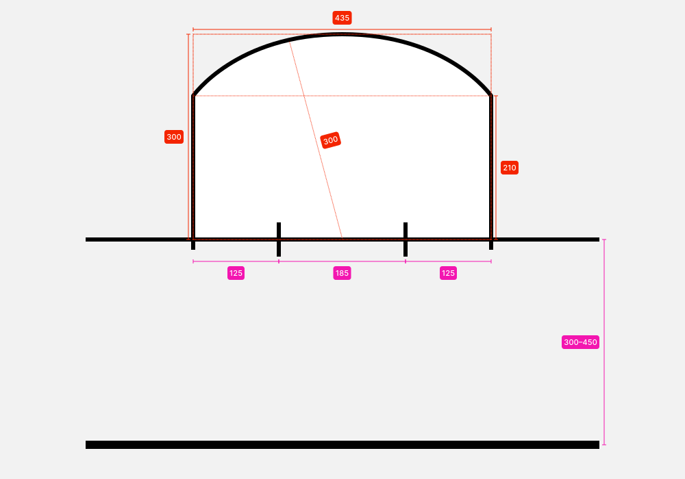
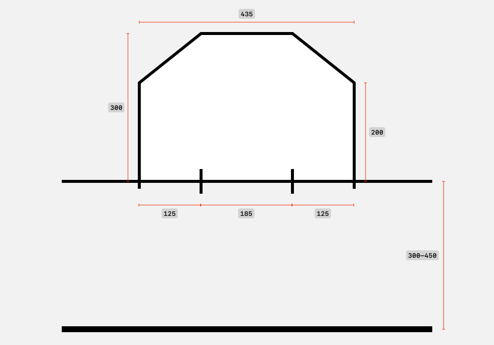

## EHBA: European Hardcourt Bikepolo Association

### Regolamento Ufficiale
##### Revisione EN: 230712\
Revisione IT: 250721

> Prima traduzione: Rayna (Napoli)\
> Revisione e aggiornamenti: Pyetro (Milano)

   ⚠️ Alcune parole, frasi o concetti, sono nella maggior parte dei casi tradotte in Italiano, tranne quando la versione Inglese, oltre che essere più breve ed esaustiva rappresenta ormai un modo di dire consolidato a livello internazionale nel Bike Polo.

---

##### **Indice**

- [EHBA Regolamento Ufficiale](#top)
- [Squadre, Giocatori & Equipaggiamento](#section1)
- [Strutture di gioco](#section2)
- [Ufficiali di Gara](#section3)
- [Giocare la palla](#section4)
- [Meccanismi di Gioco](#section5)
- [Infrazioni](#section6)
- [Penalità](#section7)
- [Procedura di penalità](#section8)

---

# Squadre, Giocatori & Equipaggiamento {#section1}

1. **Dimensione Squadra**
   1. **Formato 3v3**
      1. Ci sono tre (3) giocatori per squadra.
   1. **Formato Quads**
      1. Ci sono quattro (4) giocatori per squadra.
   1. **Formato Squad**
      1. Possono esserci da quattro (4) a sei (6) giocatori per squadra.
         1. Una squadra può avere un massimo di cinque (5) giocatori disponibili in una partita.
            1. I giocatori devono essere selezionati prima che la partita abbia inizio, la squadra deve comunicare la scelta dei giocatori agli Assistenti di Gioco prima dell'inizio della partita.

1. **Capitani delle squadre**
   1. Le squadre devono eleggere un giocatore come loro capitano durante la partita.
   1. Se il capitano della squadra viene espulso dal gioco, delegherà l'attività a un giocatore di sua scelta e informerà gli Assistenti di Gioco.
   1. I capitani delle squadre sono responsabili della trasmissione di tutte le comunicazioni dagli Ufficiali di Gara ai membri della loro squadra.
   1. I capitani delle squadre possono interagire con l'Arbitro durante le interruzioni riguardanti sostituzioni, controversie di penalità, equipaggiamento e altri casi di ragionevole dubbio.
      1. Ai capitani delle squadre non è consentito interagire con l'Arbitro durante il gioco o dall'esterno del campo.
1. **Equipaggiamento**
   1. **Divise**
      1. Le squadre devono indossare divise dello stesso colore, in contrasto con il colore della squadra avversaria.
      1. Se richiesto dall'Arbitro, le squadre devono cambiare la divisa principale con la divisa alternativa prima dell'inizio della partita.
      1. Se una squadra non ha una divisa alternativa, potrebbe venire richiesto di indossare una casacca colorata.
   1. **Equipaggiamento di sicurezza**
      1. I giocatori devono indossare un casco sportivo omologato quando sono in campo.
      1. Guanti, parastinchi e/o ginocchiere, gabbie per il viso e altri dispositivi di protezione non sono obbligatori ma sono raccomandati.
   1. **Mazze *(Mallets)***
      1. **Asta *(Shaft)***
         1. L'asta dev'essere fatta di una lega metallica o di un materiale composito che non sia suscettibile alla rottura durante quello che è considerato un gioco normale.
         1. L'impugnatura dell'asta dev'essere tappata o sigillata.
         1. L'asta non deve sporgere dalla parte inferiore della testa della mazza per più di `3 mm`.
      1. ***Testa della mazza* (Mallet Head)***
         1. La testa della mazza dev'essere fatta di un materiale che non si frantumi, non si spezzi e non si logori dando origine a un bordo tagliente.
         1. La testa della mazza deve avere forma allungata e avere solo due (2) estremità.
         1. La testa della mazza dev'essere fissata saldamente all'asta.
         1. La lunghezza massima non può superare i `130 mm` nel suo punto più lungo.
         1. Il diametro esterno massimo non può superare i `65 mm` nel suo punto più largo.
         1. Il diametro di qualsiasi foro, sul suo bordo più esterno nella testa della mazza, non può superare i `59 mm` nel suo punto più largo.
            1. Lo spessore minimo della parete tra il diametro esterno della testa e il diametro più esterno del foro è di `1.5 ± 0.5 mm`.
      1. **Impugnature**
         1. La mazza deve avere un qualche tipo di impugnatura che permetta al giocatore di afferrare saldamente l'asta.
   1. **Biciclette**
      1. Tutte le biciclette devono avere almeno un meccanismo di frenata manuale.
      1. Il manubrio deve avere una lunghezza massima di `710 mm` nel suo punto più lungo, includendo manopole e tappi.
         1. Le estremità del manubrio devono essere tappate o chiuse.
      1. Tutti i bordi taglienti devono essere rimossi o coperti.
         1. I rotori dei freni a disco devono essere protetti.
         1. Tutti i pignoni e le corone devono essere coperti dalla catena o protetti per non restare apertamente esposti.
         1. Le fascette devono essere lasciate intatte, oppure tagliate in maniera da non lasciare bordi taglienti.
         1. Le filettature sporgenti di bulloni e assi devono essere limate o coperte.
         1. Passacavi, innesti per v‐brake e qualunque altro accessorio affilato, saldato al telaio deve essere rimosso o coperto.
         1. Tutte le parti coperte delle bici devono essere approvate dal Capo Arbitro.
      1. Non possono esserci portapacchi, parafanghi, porta borraccia o qualunque altro accessorio che possa aiutare ad ostacolare il passaggio della palla.
         1. Copri ruota, copri dischi e copri catena rotondi sono permessi. 

# Strutture di gioco {#section2}

1. **Campo**
   1. **Dimensioni**
      1. I campi non possono essere più grandi di `45 ± 0.5 m` per `25 ± 0.5 m` né più piccoli di `35 ± 0.5 m` per `18 ± 0.5 m`.
   1. **Sponde**
      1. I campi devono essere delimitati da un perimetro solido tenuto saldamente insieme.
      1. Le sponde sul perimetro devono essere alte almeno `1.2 ± 0.2 m`.
         1. In caso di sponde più basse, l'arbitro può decidere di implementare regole aggiuntive riguardanti il contatto fisico e le palle fuori campo.
      1. Non ci devono essere spazi vuoti nel perimetro che consentirebbero a una palla o a qualsiasi parte del corpo o dell'attrezzatura del giocatore di entrare.
   1. **Ingressi**
      1. **Formato 3v3**
         1. Ci deve essere almeno un (1) ingresso al campo.
            1. Se sono disponibili due (2) ingressi, devono essere simmetrici rispetto alla linea centrale del campo.
      1. **Formato Quads**
         1. Ci deve essere almeno un (1) ingresso al campo.
            1. Se è disponibile un solo ingresso, oppure se entrambi gli ingressi non sono simmetrici rispetto alla linea centrale del campo o non ugualmente accessibili ai giocatori per entrare o uscire, una squadra può richiedere un Timeout di sostituzione come da [`5.13.1`](#5.13.1).
         1. Su un campo con due ingressi simmetrici rispetto alla linea centrale, un arco sarà marcato a `3 ± 0.25 m` dal centro di ciascun ingresso e verrà indicato come Area di Transizione dei giocatori.
      1. **Formato Squad**
         1. Ci devono essere due (2) ingressi al campo, simmetrici rispetto alla linea centrale del campo.
         1. Un arco sarà marcato a `3 ± 0.25 m` dal centro di ciascun ingresso e verrà indicato come Area di Transizione dei giocatori.
   1. **Linee**
      1. Tutte le linee devono avere uno spessore massimo di `5 cm`.
      1. Il campo verrà segmentato per tutta la sua larghezza in tre posizioni:\
         - metà campo, o *linea centrale;*\
         - entrambe le Linee di Porta.\
            1. Verrà marcata la metà della linea centrale per posizionare la palla per le "contese" *(Joust).*
      1. Le Linee di Porta devono essere parallele alla sponda di fondo e a `3–4.5 m` di distanza da essa, a seconda delle dimensioni del campo.
         1. Le Linee di Porta non possono essere distanti meno di `29 ± 0.5 m` l'una dall'altra.
      1. Le Linee di Porta devono essere tracciate per posizionare lo Specchio della Porta, centrato rispetto alla larghezza del campo, definendo quella che verrà chiamata Linea dello Specchio della Porta.
         1. Lo Specchio della Porta deve essere delimitato da due (2) linee perpendicolari che si estendono di `10 ± 1 cm` verso il centro del campo e `20 ± 1 cm` dietro la porta.
         1. Le due (2) linee verticali devono coincidere con le dimensioni delle porte usate, usando come riferimento l'interno dei pali.
   1. **Area di Tocco  *(Tap-In)***
      1. Saranno tracciate due (2) linee sulle sponde di entrambi i lati del campo e saranno considerate come Aree di Tocco *(tap-in).*
      1. Le linee verranno disegnate ad ogni lato a `0.75 ± 0.10 m` dalla linea centrale.
   1. **Area di Porta *(Crease)***
      1. Verrà tracciata un'area davanti alla porta e verrà definita come *area di porta.*
      1. La dimensione dell'Area di Porta deve essere un semicerchio di `3 ± 0.1 m` dal centro dell'apertura della porta, tagliato a `1.25 ± 0.1 m` dall'esterno di ciascun delimitatore dello Specchio della Porta. Vedi [`Diagramma 1`](#diagram1).
         1. L'Area di Porta può essere disegnata con linee rette, come nel [`Diagramma 2`](#diagram2).
1. **Porte *(Goals)***
   1. Le Porte devono avere le reti.
   1. Le Porte devono avere una traversa rigida posizionata sopra la Linea di Porta.
   1. Le Porte sono posizionate in modo che lo Specchio della Porta sia uno di fronte all'altro, nelle posizioni marcate sulla Linea di Porta.
   1. Lo Specchio della Porta è largo `185 ± 5 cm`, misurato dall'interno dei pali.
   1. Lo Specchio della Porta è alto `90 ± 5 cm`, misurato dal suolo all'interno della traversa.
   1. La Porta è profonda `80 ± 15 cm`, misurata dal centro della Linea di Porta.
1. **Palle**
   1. Le Palle devono avere diametro di `67 ± 2 mm`.
   1. Le Palle devono pesare `70 ± 5 g`.
   1. Le Palle devono essere realizzate con un materiale a basso rimbalzo e resistente agli urti.
      1. La durezza del materiale deve corrispondere alla sua temperatura di prestazione ottimale.

### Diagramma 1: Area di porta {#diagram1}

### Diagramma 2: Versione alternativa dell'area di porta {#diagram2}

# Ufficiali di Gara {#section3}
1. **Ufficiali di Gara**
   1. Un torneo richiede un Capo Arbitro *(Head Referee)* designato dagli organizzatori dell'evento e comunicato ai giocatori all'inizio del torneo.
   1. Una partita ha bisogno dei seguenti Ufficiali di Gara:\
      - Arbitro *(Main Referee)*;\
      - Due (2) Giudici di Porta *(Goal Judges or Referees)*;\
      - Assistenti di Gioco *(Game Assistant)*;\
      - Assistente Arbitro *(Assistant Referee)*.
         1. Uno degli arbitri viene designato come Arbitro per dirigere la partita e viene comunicato a ciascuna squadra prima dell'inizio della partita.
         1. I Giudici di Porta vengono nominati e approvati dall'Arbitro prima dell'inizio della partita.
            1. I Giudici di Porta sono visivamente distinguibili dagli spettatori.
         1. Gli Assistenti di Gioco e gli Assistenti Arbitro non sono obbligatori, ma consigliati.
            1. Nel caso in cui gli Assistenti di Gioco non siano disponibili l'Arbitro si assumerà le loro responsabilità e doveri.
1. **Attrezzatura**
   1. Gli organizzatori dell'evento devono fornire la seguente attrezzatura agli Ufficiali di Gara:\
      - orologio o cronometro;\
      - fischietto;\
      - tabellone;\
      - bandiere, cappelli o casacche (2) per i Giudici di Porta;\
      - penna e carta;\
      - adesivi "Bike Check", nastro adesivo o marcatori simili;\
      - casacche colorate per i giocatori.
1. **Posizionamento**
   1. **Arbitro**
      1. L'Arbitro e gli Assistenti di Gioco devono essere posizionati a metà campo, con una visuale diretta, e non ostruita, del campo, preferibilmente dall'alto.
   1. **Assistenti di Gioco**
      1. Gli Assistenti di Gioco devono essere posizionati vicino all'Arbitro a una distanza che renda agevole la comunicazione.
   1. **Assistente Arbitro** 
      1. L'Assistente Arbitro può posizionarsi lungo il campo per aiutare a segnalare azioni difficili da vedere dall'Arbitro, altrimenti si posizionerà accanto all'Arbitro per seguire le azioni sulla palla e lontane dalla palla, in base alle esigenze del gioco.
   1. **Giudici di Porta**
      1. I Giudici di Porta devono essere posizionati sul lato opposto dell'Arbitro, vicino alla *linea di porta* leggermente verso la metà campo, con una vista chiara e non ostacolata dello *specchio della porta,* preferibilmente dall'alto.
         1. Nel caso in cui il posizionamento non sia disponibile, devono essere posizionati dietro o leggermente a lato della porta, a seconda di dove si ha una visione migliore dello Specchio della Porta. Il loro posizionamento deve essere approvato dall'Arbitro.
1. **Compiti**
   1. **Capo Arbitro**
      1. Il Capo Arbitro supervisiona la corretta applicazione del regolamento da parte degli altri Ufficiali di Gara.
         1. Il Capo Arbitro non può annullare le decisioni prese dall'Arbitro durante una partita.
      1. Il Capo Arbitro deve fornire una copia aggiornata del regolamento come riferimento.
         1. È responsabilità del Capo Arbitro spiegare il regolamento ai giocatori e agli altri Ufficiali di Gara.
      1. Il Capo Arbitro ispeziona l'equipaggiamento dei giocatori prima dell'inizio dell'evento per determinarne la sicurezza e la conformità come da [`1.3`](#1.3).
         1. Il Capo Arbitro può essere aiutato da altri Ufficiali di Gara per verificare l'attrezzatura.
      1. Il punteggio finale delle partite perse a tavolino viene definito e annunciato dal Capo Arbitro prima dell'inizio del torneo.
   1. **Arbitro**
      1. L'Arbitro mantiene il pieno controllo del gioco, applicando il regolamento al meglio delle proprie capacità.
         1. È responsabilità dell'Arbitro valutare la gravità di tutte le infrazioni ed emettere qualsiasi penalità elencata nella [`Sezione 7`](#section7) in modo tale da eliminare lo svantaggio competitivo.
      1. L'Arbitro può ispezionare l'equipaggiamento dei giocatori prima della partita e procedere come da [`5.12`](#5.12) se l'equipaggiamento non è considerato sicuro.
      1. L'Arbitro segnala l'inizio e la fine della partita come da [`5.1`](#5.1) e [`5.5`](#5.5).
      1. L'Arbitro segnala tutte le interruzioni e le riprese del gioco come da [`5.3`](#5.3) e [`5.4`](#5.4).
      1. L'Arbitro segnala tutte le infrazioni come da [`Sezione 6`](#section6).
   1. **Giudici di Porta**
      1. I Giudici di Porta devono segnalare i punti realizzati sul loro lato del campo come da [`3.5.2.1`](#3.5.2.1).
      1. I Giudici di Porta dovrebbero segnalare ciò che percepiscono come una penalità nelle loro immediate vicinanze come da [`3.5.2.3`](#3.5.2.3).
         1. I Giudici di Porta devono essere pronti a fornire una prospettiva all'Arbitro in merito a eventuali punti o penalità.
         1. L'interazione con l'Arbitro è strettamente consultiva e la decisione finale spetta all'Arbitro.
      1. I Giudici di Porta devono riposizionare le porte in caso vengano spostate o rovesciate durante il gioco.
         1. Se il campo non consente l'accesso ai giudici di porta, l'Arbitro deve delegare questa responsabilità ad altri volontari.
         1. Se non è disponibile l'accesso al campo, i giocatori vengono informati della responsabilità di riposizionare le porte.
      1. I Giudici di Porta devono segnalare, come da [`3.5.2.3`](#3.5.2.3), false partenze durante la contesa (joust) come da [`5.2.1.1`](#5.2.1.1).
      1. I Giudici di Porta possono segnalare un *Timeout* altrimenti non udito dall'Arbitro, dagli Assistenti di Gioco o dall'Assistente Arbitro.
   1. **Assistenti di Gioco**
      1. L'Assistente di Gioco tiene il tempo della partita ed è responsabile dell'avvio e interruzione del cronometro ufficiale.
      1. L'Assistente di Gioco tiene il tempo delle penalità assegnate ai giocatori quando sono temporaneamente esclusi dal gioco.
         1. L'Assistente di Gioco ha la responsabilità di far sapere ai giocatori temporaneamente esclusi dal gioco quando possono rientrare. 
      1. L'Assistente di Gioco compila e mantiene un registro di gioco *(Game Log)* cartaceo.
      1. Il registro di gioco contiene le seguenti informazioni:\
         - i goal di ogni squadra;\
         - le penalità di ogni giocatore.
            1. L'organizzatore dell'evento, in aggiunta, può richiedere anche:\
               - I tempi di tutti i goal e penalità chiamate;\
               - I nomi di chi segna i goal.
      1. Se è presente un timer e un tabellone del punteggio visibile ai giocatori, l'Assistente di Gioco si occupa di far partire il tempo, fermarlo e aggiornare i goal sul tabellone.
      1. L'Assistente di Gioco chiama ad alta voce i tempi di gioco a intervalli periodici e anche nelle seguenti situazioni:\
         - dopo i goal;\
         - a metà partita;\
         - ad ogni ripresa;\
         - due (2) minuti dalla fine;\
         - su richiesta dei giocatori.
            1. Dopo aver chiamato due (2) minuti, l'Assistente di Gioco deve chiamare sessanta (60) secondi, trenta (30) secondi, dieci (10) secondi e un conto alla rovescia da cinque (5) secondi a uno (1).
   1. **Assistente Arbitro**
      1. L'Assistente Arbitro può segnalare quello che ritiene una penalità secondo il punto [`3.5.3.1`](#3.5.3.1).
         1. L'Assistente Arbitro dev'essere preparato a fornire una prospettiva all'Arbitro riguardo qualunque potenziale punto o penalità.
         1. Le interazioni con l'Arbitro sono strettamente consultive, la chiamata finale dev'essere fatta dall'Arbitro.
      1. L'Assistente Arbitro può segnalare un Timeout (come da [`3.5.3.2`](#3.5.3.2)) che non è stato sentito dall'Arbitro o dall'Assistente di Gioco.
1. **Segnali manuali**
   1. **Arbitro**
      1. Inizio del gioco—Alza un braccio in alto, lasciandolo cadere nel momento in cui fischia.
      1. Ripresa del gioco—Stende un braccio in avanti con il palmo rivolto verso l'alto per indicare che il gioco può iniziare.
      1. Penalità ritardata/Vantaggio—Solleva il braccio esteso verso l'alto.
      1. Possesso dopo un'interruzione—Tende un braccio in direzione della squadra che riprenderà il gioco con la palla.
   1. **Giudici di Porta**
      1. Goal segnato—Solleva il braccio esteso verso l'alto.
         1. Alza la bandiera, se è disponibile.
      1. Tiro mancato/Goal non valido—Incrocia le braccia in avanti e le apre verso l'esterno con un movimento ampio.
      1. Falsa Partenza/Infrazione—Alza un braccio in alto e con l'altro indica il giocatore che ha commesso l'infrazione.
         1. Se è disponibile una bandiera, il Giudice di Porta la alza estendendo l'altro braccio.
      1. Timeout—Mima una "T" con entrambe le braccia.
   1. **Assistente Arbitro**
      1. Infrazione—Alza un braccio e con l'altro indica il giocatore che ha commesso l'infrazione.
      1. Timeout—Mima una "T" con entrambe le braccia.

# Giocare la palla {#section4}
1. **Possesso di palla**
   1. Il giocatore che ha eseguito intenzionalmente l'ultimo tocco controllato sulla palla con la mazza è considerato in possesso di palla. Il giocatore in possesso è noto come Portatore di Palla.
      1. Un giocatore non è considerato in possesso della palla, o il possesso viene ceduto nei seguenti casi:\
         - La palla si muove a circa 3 metri di distanza dal Portatore di Palla;\
         - La palla si muove così velocemente in prossimità di un giocatore che non è in grado di eseguire più di un (1) tocco controllato sulla palla libera;\
         - Il Portatore di Palla non è più in grado di giocare la palla con la mazza.
      1. Il possesso non è perso dal Portatore di Palla se un tocco intenzionale sulla palla da parte di un avversario, non ostacola l'abilità del Portatore di continuare a giocare la palla con la mazza e la palla resta in prossimità di circa tre (3) metri.
1. **Tiro**
   1. Un tiro viene definito come un urto elastico tra uno dei lati terminali della testa della mazza e la palla.
   1. Direzionare intenzionalmente la palla per mezzo di un contatto con qualunque parte del corpo o della bici non è un tiro.
   1. Uno "shuffle", "ball‐joint", "scoop" o "trasporto", come da [`4.3`](#4.3) fino a [`4.6`](#4.6), non viene considerato un tiro.
   1. Qualunque contatto con l'asta della mazza non è un tiro.
   1. Una palla deviata da una superficie o equipaggiamento che viene da un'azione che non è stata un tiro non è considerata un tiro.
1. **Shuffling**
   1. Viene definito "Shuffle" qualunque contatto tra la parte allungata della testa della mazza e la palla.
1. **Ball–Jointing**
   1. Viene definito "Ball–Jointing" la pressione applicata sulla palla usando qualunque foro o superficie concava della testa della mazza allo scopo di incastrarla contro una qualsiasi superficie del campo.
   1. Il "Ball–Jointing" è permesso in qualunque punto del campo per un tempo limitato di due (2) secondi.
1. **Scooping**
   1. Viene definito "Scoop" il manovrare la palla a coppa in un buco della testa della mazza usando la forza centripeta per mantenere la palla nel buco.
   1. Lo "Scoop" è permesso al di sotto dell'altezza del manubrio del giocatore, o di quello dell'avversario se questi si trova a meno di `3 m` circa, come da [`6.4.4.3`](#6.4.4.3). 
   1. Lo "Scoop" è permesso per non più di tre (3) cambi di direzione.
1. **Trasporto *(Carrying)***
   1. Viene definito "Carrying" il trasportare la palla con la testa della mazza, grazie alla forza di gravità che tiene la palla ferma nella testa.
   1. Il "Carrying" non è permesso.
1. **Afferrare *(Grabbing)***
   1. Viene definito "Grabbing" usare la mano per afferrare la palla.
   1. Il "Grabbing" non è permesso.
      1. Un giocatore può usare una delle due mani per fermare una palla al volo, ma deve immediatamente deviare la palla verso il suolo, al di sotto del punto in cui è stata fermata.
1. **Slapping**
   1. Reindirizzare intenzionalmente o dare impulso alla palla con le mani o i piedi è considerato "Slapping".
   1. Lo "Slapping" non è permesso.
      1. Un giocatore difensivo all'interno della propria area di porta può usare le mani per reindirizzare, ma non afferrare, una palla al volo che si trovi sotto l'altezza delle spalle.

# Meccanismi di Gioco {#section5}
1. **Inizio del gioco**
   1. Le squadre si preparano per la giostra (*Joust*) come da [`5.2`](#5.2).
   1. L'Arbitro chiede ad ogni squadra se è pronta. Il capitano di ogni squadra deve dare una chiara conferma o declinazione verbale.
      1. I capitani delle squadre possono confermare alzando la mano o declinare estendendo la mano rivolta verso l'esterno e ondeggiandola da una parte all'altra.
   1. Quando entrambe le squadre confermano di essere pronte, l'Arbitro alza la mano e fischia lasciandola cadere simultaneamente, per segnalare l'inizio.
      1. L'Assistente di Gioco fa partire il tempo al fischio.
      1. Le squadre possono gareggiare per il possesso di palla.
1. **La Giostra (*Joust*)**
   1. Ogni squadra si posiziona nel proprio lato del campo; i giocatori stazionano sulle biciclette con la ruota posteriore che tocca la sponda alle spalle della porta.
      1. Si ha una Falsa Partenza quando un giocatore lascia la sponda prima del fischio di inizio del gioco.
         1. Il Giudice di Porta deve segnalare una Falsa Partenza, come da [`3.5.2.3`](#3.5.2.3), se qualunque giocatore lascia la sponda prima del fischio di inizio.
         1. Un vantaggio della squadra che ha commesso la Falsa Partenza si convertirà in una penalità e il possesso di palla è concesso alla squadra che ha perso la Giostra.
   1. I giocatori che partono alla Giostra devono tenere la mazza sullo stesso lato della bici.
      1. Di default, le Giostre si svolgono sul lato destro.
      1. Le squadre possono accordarsi per una Giostra mancina, informando l'Arbitro prima dell'inizio del gioco.
         1. In caso di disaccordo, il lato della Giostra sarà determinato dal lato sul quale la maggioranza dei giocatori tiene la mazza.
      1. In una Giostra di destri, i giocatori devono correre sul lato sinistro del loro avversario quando si incontrano e sorpassano. In una Giostra di mancini, i giocatori devono correre sul lato destro del loro avversario.
   1. Solo un (1) giocatore per squadra può partecipare alla Giostra.
      1. I giocatori che corrono nella Giostra devono mantenere direzione retta fino a quando uno dei giocatori entra in contatto con la palla.
      1. Qualunque giocatore che corre verso la palla con un ritmo costante viene considerato un partecipante alla Giostra.
         1. I giocatori che corrono nella Giostra, non possono smettere di correre una volta che sono a circa 3 metri dalla palla.
      1. Un giocatore in Giostra non può interferire con la traiettoria di Giostra di un avversario.
         1. Qualunque azione di un giocatore in Giostra ritenuta pericolosa dall'Arbitro sarà punita con una Penalità Maggiore.
      1. Tutti gli altri giocatori non possono gareggiare per il possesso di palla o posizionarsi nella traiettoria di un giocatore che concorre nella Giostra, almeno fino a quando il possesso non è stabilito o entrambi i giocatori in corsa nella Giostra superano la palla, non riuscendo a guadagnarsi il possesso di palla.
1. **Interruzione del Gioco**
   1. L'Arbitro segnala l'interruzione del gioco fischiando.
      1. Una volta che l'Arbitro segnala l'interruzione, il gioco deve fermarsi indipendentemente dalle circostanze.
   1. Il gioco può essere interrotto per una delle seguenti ragioni:\
      - goal;\
      - penalità;\
      - palla fuori campo;\
      - infortunio;\
      - porta spostata;\
      - time-out;\
      - equipaggiamento non sicuro;\
      - riparazione delle strutture di gioco.
   1. Le squadre devono smettere di giocare e tornare nella propria metà campo entro dieci (10) secondi dal fischio.
   1. **Formato 3v3**
      1. L'Assistente di Gioco deve fermare il tempo ad ogni interruzione del gioco.
   1. **Formato Quads**
      1. Il cronometro continua a scorrere, ad eccezione degli infortuni o di circostanze che impedirebbero una rapida ripresa del gioco, come, ma non solo:\
         - danni al campo;\
         - palla rotta o mancante;\
         - valutazione e revisione di un'azione, un fallo o un goal da parte degli Ufficiali di Gara.
            1. Durante gli ultimi due (2) minuti della partita, l'Assistente di Gioco ferma il tempo ad ogni interruzione del gioco.
   1. **Formato Squad**
      1. Il cronometro continua a scorrere, ad eccezione degli infortuni o di circostanze che impedirebbero una rapida ripresa del gioco, come, ma non solo:\
         - danni al campo;\
         - palla rotta o mancante;\
         - valutazione e revisione di un'azione, un fallo o un goal da parte degli Ufficiali di Gara.
            1. Durante gli ultimi due (2) minuti della partita, l'Assistente di Gioco ferma il tempo ad ogni interruzione del gioco.
1. **Ripresa del Gioco**
   1. L'Arbitro sollecita alla squadra senza il possesso di palla una conferma visiva o verbale che sia pronta a riprendere il gioco.
      1. L'Arbitro può fischiare velocemente due volte per sollecitare la conferma della squadra.
      1. In caso la squadra senza possesso di palla non comunica di essere pronta entro dieci (10) secondi viene assegnata una Penalità di Ritardo di Gioco come da [`6.1.1`](#6.1.1).
   1. Dopo la conferma, l'Arbitro indica che il gioco riparte come da [`3.5.1.2`](#3.5.1.2) e annuncia “10 secondi per oltrepassare la metà campo”.
      1. Se la squadra in possesso di palla non inizia a giocare entro dieci (10) secondi da quando l'altra squadra ha confermato di essere pronta, la squadra senza il possesso di palla può iniziare a giocare superando la metà campo.
         1. L'Arbitro segnala verbalmente “gioco” (*game on*).
         1. L'Assistente di Gioco fa ripartire il tempo.
   1. Il gioco inizia e il tempo riparte quando la palla o un giocatore della squadra con il possesso della palla, supera la metà campo.
      1. L'Arbitro indica l'inizio del tempo annunciando “gioco” (*game on*).
      1. I giocatori della squadra senza il possesso di palla non possono attaccare l'altra squadra prima che inizi il gioco.
1. **Fine del Gioco**
   1. L'orologio ufficiale di gioco indica la fine della partita.
   1. L'Arbitro segnala la fine del gioco con due fischi lunghi.
1. **Punteggio**
   1. **Goal**
      1. Si guadagna un punto quando la palla attraversa completamente la Linea dello Specchio della Porta avendo avuto origine da un tiro, come definito in [`4.2`](#4.2).
         1. Un tiro può deviare su una qualunque superficie, ad eccezione del lato lungo della testa della mazza o dell'asta della mazza di un giocatore in attacco, prima di attraversare la Linea dello Specchio della Porta ed essere considerato valido.
      1. Il Giudice di Porta segnala un goal come da [`3.5.2.1`](#3.5.2.1). e il gioco riparte come da [`5.4`](#5.4).
   1. **Goal non validi**
      1. Non viene assegnato un punto nel caso in cui la palla attraversa la Linea dello Specchio della Porta per mezzo di un'azione di un giocatore in attacco che non è stata un tiro.
      1. Non viene assegnato punto nelle seguenti situazioni:\
         - Qualunque palla che superi la Linea dello Specchio della Porta dopo un fischio.\
         - Qualunque azione sulla palla che avvenga prima che il gioco abbia inizio come da [`5.4.3`](#5.4.3)\
         - Un giocatore in attacco commette un'infrazione durante un'azione che porta a un goal, indipendentemente dal momento in cui la palla attraversa la Linea dello Specchio della Porta.
      1. Il Giudice di Porta segnala un goal non valido come indicato in [`3.5.2.2`](#3.5.2.2).
      1. La squadra in attacco perde il possesso di palla e il gioco ricomincia come da [`5.4`](#5.4).
   1. **Autogoal**
      1. Viene assegnato un punto alla squadra avversaria quando una qualsiasi azione sulla palla da parte di un giocatore fa sì che l'intera palla attraversi la Linea dello Specchio della Porta della porta difesa.
      1. Il Giudice di Porta segnala un autogoal come da [`3.5.2.1`](#3.5.2.1) e il gioco riprende come da [`5.4`](#5.4).
1. **Palla Fuori Gioco**
   1. **Fuori Campo**
      1. La palla è fuori gioco quando lascia il campo o rimbalza su qualunque oggetto al di sopra delle sponde.
         1. Il possesso di palla è perso dalla squadra che ha toccato per ultima la palla, incluse deviazioni sul corpo o sulla bici di un giocatore.
   1. **Palla Bloccata**
      1. Una palla è considerata bloccata quando è incastrata, intrappolata oppure bloccata nell'equipaggiamento di un giocatore o in una struttura del campo.
         1. Il possesso di palla è perso dalla squadra che ha la palla incastrata nel proprio equipaggiamento.
         1. Il possesso viene perso dalla squadra che ha toccato per ultimo la palla, incluse le deviazioni sul corpo o sulla bici di un giocatore, quando la palla resta bloccata in una struttura del campo.
1. **Infortuni**
   1. L'interruzione del gioco per l'infortunio di un giocatore è decisa a discrezione dell'Arbitro, il quale determina se un giocatore necessita di attenzione immediata.
      1. Non c'è un limite di tempo definito all'interruzione di gioco in caso di infortunio.
      1. I giocatori non sono tenuti a tornare nella propria metà campo come da [`5.3.3`](#5.3.3) se interessati alla sicurezza o il benessere di un giocatore, nel caso possano assistere il giocatore infortunato.
   1. Il possesso di palla ritorna alla squadra che ne aveva possesso al momento dell'interruzione a meno che non venga assegnata una penalità dall'Arbitro.
   1. Il gioco riprende come da [`5.4`](#5.4) a seguito del recupero del giocatore infortunato o l'entrata in campo di un giocatore sostitutivo come da [`5.9`](#5.9).
1. **Sostituzione di un giocatore**
   1. **Formato 3v3**
      1. Una squadra può chiedere all'Arbitro la sostituzione di un giocatore in caso di infortunio o in altre circostanze eccezionali, durante il corso del gioco o tra le partite.
   1. **Formato Quads**
      1. Una squadra non può sostituire nessun giocatore durante una partita.
      1. Una squadra deve continuare a giocare con tre (3) giocatori fino a quando non viene trovato e approvato un sostituto idoneo come da [`5.9.4`](#5.9.4).
   1. **Formato Squad**
      1. Una squadra non può sostituire nessun giocatore durante una partita.
      1. Una squadra non può chiedere all'Arbitro la sostituzione di un giocatore fino a quando non ha meno di quattro (4) giocatori non infortunati disponibili a giocare.
   1. **Procedura generale per la sostituzione**
      1. I giocatori sostituiti perdono la possibilità di essere scelti per giocare in qualunque altra squadra durante un torneo.
      1. Gli unici giocatori eleggibili per la sostituzione sono quelli che non sono entrati nel torneo, oppure giocatori che sono già stati eliminati prima della fase o girone di eliminazione in corso.
      1. Un giocatore sostituto può essere a sua volta sostituito solo dal giocatore originale o in caso di un successivo infortunio.
         1. Se un giocatore originale si riunisce alla squadra dopo una sostituzione, la squadra perde la possibilità di una sostituzione secondaria per quel giocatore.
         1. Ulteriori infortuni o l'inabilità del giocatore a continuare portano la squadra a proseguire senza il giocatore per il resto del torneo.
      1. Alla squadra viene concessa una ragionevole quantità di tempo (non superiore ai 5 minuti) per trovare un rimpiazzo che venga approvato dal Capo Arbitro.
      1. Se un giocatore viene espulso dal torneo la sua squadra può richiedere un sostituto solo dopo la partita in cui è avvenuta l'espulsione.
1. **Timeout**
   1. **Formato 3v3**
      1. Ad ogni squadra sono concessi due (2) Timeout per partita, di durata massima di due (2) minuti ciascuno.
         1. I Timeout possono essere richiesti consecutivamente, se necessario.
            1. Una squadra che non è pronta a giocare nei dieci (10) secondi di tempo limite dopo i due (2) minuti di pausa del primo Timeout deve richiedere, se disponibile, il secondo Timeout per estendere l'interruzione di gioco.
      1. Durante qualsiasi interruzione di gioco, ogni squadra può chiamare un Timeout per allungare il limite di dieci (10) secondi prima che il gioco riprenda.
         1. La squadra che ha diritto al possesso di palla non lo perde quando il gioco riprende.
      1. Nel corso dell'azione di gioco, una squadra può chiedere un'interruzione di gioco guadagnando il possesso e chiamando ad alta voce “Timeout” rivolgendosi all'Arbitro.
         1. La squadra che ha chiamato il Timeout perde il possesso di palla.
            1. I Timeout richiesti durante l'azione di gioco a causa di una palla rotta o dell'infortunio di un giocatore che necessita di attenzioni mediche immediate portano la squadra a mantenere il possesso di palla alla ripresa del gioco e non influiscono sul numero di Timeout disponibili.
            1. Alla scadenza del Timeout o quando la squadra che l'ha richiesto si dichiara pronta, il gioco può ricominciare come da [`5.4`](#5.4).
      1. I Giudici di Porta e l'Assistente Arbitro possono segnalare la richiesta di Timeout all'Arbitro come da [`3.5.2.4`](#3.5.2.4).
      1. In caso di problemi meccanici che richiedono la riparazione della bici o dell'attrezzatura di un giocatore, causati dalla squadra avversaria, possono essere concessi cinque (5) minuti di pausa dall'Arbitro.
         1. Questo Timeout non influenza il numero di Timeout disponibili della squadra.
         1. La squadra può allungare la pausa con i propri Timeout disponibili se necessario.
         1. La squadra che ha diritto al possesso di palla quando il gioco riprende, non cede il possesso all'avversario.
   1. **Formato Quads**
      1. Ad ogni squadra sono concessi due (2) Timeout per partita, di durata massima di un (1) minuto ciascuno.
         1. I Timeout possono essere richiesti consecutivamente, se necessario.
            1. Una squadra che non è pronta a giocare nei dieci (10) secondi di tempo limite dopo il minuto (1) di pausa del primo Timeout deve richiedere, se disponibile, il secondo Timeout per estendere l'interruzione di gioco.
      1. Sui campi che non permettono cambi durante l'azione di gioco, le squadre possono richiedere fino a due (2) Timeout aggiuntivi di 30 secondi per cambiare la formazione mentre sono in possesso di palla.
      1. I problemi meccanici che richiedono la riparazione della bici o dell'attrezzatura di un giocatore comportano la sostituzione del giocatore con un altro membro della sua squadra, senza interruzione del gioco, come da [`5.13.1`](#5.13.1).
      1. Nel corso dell'azione di gioco, una squadra può chiedere un'interruzione di gioco guadagnando il possesso e chiamando ad alta voce “Timeout” rivolgendosi all'Arbitro.
         1. La squadra che ha chiamato il Timeout perde il possesso di palla.
            1. I Timeout richiesti durante l'azione di gioco a causa di una palla rotta o dell'infortunio di un giocatore che necessita di attenzioni mediche immediate portano la squadra a mantenere il possesso di palla alla ripresa del gioco e non influiscono sul numero di Timeout disponibili.
            1. Alla scadenza del Timeout o quando la squadra che l'ha richiesto si dichiara pronta, il gioco può ricominciare come da [`5.4`](#5.4).
      1. I Giudici di Porta e l'Assistente Arbitro possono segnalare la richiesta di Timeout all'Arbitro come da [`3.5.2.4`](#3.5.2.4).
   1. **Formato Squad**
      1. I problemi meccanici che richiedono la riparazione della bici o dell'attrezzatura di un giocatore comportano la sostituzione del giocatore con un altro membro della sua squadra, senza interruzione del gioco, come da [`5.13`](#5.13).
1. **Posizione sbagliata della porta**
   1. Se la porta cambia posizione, la Linea dello Specchio della Porta, come definita in [`2.1.4.4`](#2.1.4.4), resta la soglia che la palla deve oltrepassare perché un punto venga assegnato.
   1. L'Arbitro può fermare il gioco se la posizione della porta si è spostata tanto da impedire al Giudice di Porta di determinare se un punto è stato segnato o se è evidente che la posizione spostata della porta influisce sullo svolgimento del gioco.
   1. Una porta spostata dalla sua posizione originale a causa di una circostanza non intenzionale e fortuita non comporta una penalità.
   1. Il possesso di palla viene mantenuto dalla squadra che lo aveva prima dell'interruzione del gioco.
      1. Se nessuna squadra aveva il possesso di palla al momento dell'interruzione, il gioco riprende con una Giostra come da [`5.2`](#5.2).
   1. Quando la porta viene rimessa nella posizione corretta dal Giudice di Porta come da [`3.4.3.3`](#3.4.3.3) senza interferire con il gioco, non richiede interruzione del gioco.
      1. Un difensore nella propria Area di Porta può portare la porta leggermente spostata, nella sua posizione corretta, se l'operazione non interferisce in alcun modo con lo svolgimento del gioco.
1. **Attrezzatura non sicura**
   1. L'Arbitro può interrompere il gioco se ad un certo punto di una partita ritiene che l'equipaggiamento di un giocatore non sia sicuro.
   1. La squadra deve ricorrere ai propri Timeout disponibili per risolvere il problema o sostituire la bici.
      1. Se il problema non può essere risolto o una bici sostitutiva non è disponibile nel tempo concesso, il gioco riprenderà senza il giocatore in questione quindi con un Vantaggio del Giocatore per la squadra avversaria.
      1. Il giocatore escluso può essere reintegrato in partita alla successiva interruzione di gioco.
   1. L'Arbitro deve approvare l'attrezzatura del giocatore in questione prima della ripresa del gioco.
      1. Nel caso in cui l'attrezzatura non sia ritenuta sicura dall'Arbitro, il giocatore sarà escluso dal gioco fino alla risoluzione del problema.
1. **Meccanismi di panchina**
   1. **Formato Quads**
      1. La squadra può sostituire i propri giocatori in panchina con uno dei 3 giocatori in campo, entrando e uscendo attraverso l'ingresso designato alla propria squadra, situato nella metà difensiva del campo.
         1. Sui campi che non permettono cambi durante l'azione di gioco, i giocatori devono richiedere un Timeout di cambio formazione come da [`5.10.2`](#5.10.2).
            1. Durante le interruzioni, una squadra può sostituire i giocatori nei limiti di tempo previsti come da [`5.4`](#5.4).
         1. In una squadra di tre (3) giocatori, l'incapacità di un giocatore di continuare a giocare durante una partita, per un problema meccanico o un infortunio, comporta un Vantaggio del Giocatore per la squadra avversaria come da [`8.5`](#8.5), fino a quando tale giocatore non è in grado di rientrare in partita.
      1. Prima che un nuovo giocatore entri in campo, il giocatore che sta tentando l'uscita dal campo deve essere nell'Area di Transizione, delimitata a `3 ± 0.5 m` dal centro dell'ingresso designato alla propria squadra.
         1. Se un giocatore che entra o esce dal campo interferisce con una palla libera o con un avversario durante la sostituzione, viene chiamata un'infrazione di Sostituzione Illegale come da [`6.1.5`](#6.1.5).
   1. **Formato Squad**
      1. La squadra può sostituire qualunque giocatore in panchina con uno dei 3 giocatori in campo, entrando e uscendo attraverso l'ingresso designato alla propria squadra, situato nella metà difensiva del campo.
      1. Prima che un nuovo giocatore entri in campo, il giocatore che sta tentando l'uscita dal campo deve essere nell'Area di Transizione, delimitata a `3 ± 0.5 m` dal centro dell'ingresso designato alla propria squadra.
         1. Se un giocatore che entra o esce dal campo interferisce con una palla libera o con un portatore di palla avversario durante la sostituzione, viene chiamata un'infrazione di Sostituzione Illegale come da [`6.1.5`](#6.1.5).

# Infrazioni {#section6}
1. **Infrazioni Tecniche**
   1. **Ritardo di Gioco**
      1. Una squadra ostacola la ripresa del gioco come da [`5.4`](#5.4).
         1. Un Fallo Personale viene automaticamente assegnato al capitano della squadra alla prima infrazione.
         1. Per qualsiasi infrazione successiva viene assegnata una Penalità Minore al capitano della squadra.
      1. Un giocatore blocca la palla con la mazza o la bici mentre è appoggiato contro le sponde, impedendo agli altri giocatori di giocarla.
      1. Un giocatore fa uscire la palla dal gioco raccogliendola con il lato cavo della testa (*Scooping*) o tirandola fuori dal gioco di proposito.
      1. Un giocatore sposta di proposito la posizione della porta come da [`5.11`](#5.11).
   1. **Comportamento Antisportivo**
      1. Il comportamento di un giocatore viene considerato antisportivo secondo, ma non limitato a, i seguenti criteri:\
         - Generali e continuative interruzioni delle procedure di gioco;\
         - Eccessive proteste contro gli ufficiali di gioco;\
         - Essere attivamente coinvolto nel gioco dopo un'Infrazione di Piede (*Dabbing*);\
         - Incapacità di uscire dopo un'Infrazione di Piede (*Dabbing*), che comporta un vantaggio per la propria squadra;\
         - Interagire o schermare un giocatore che ha appena commesso un'Infrazione di Piede (*Dabbed*), o rendere la sua attrezzatura più difficile da recuperare;\
         - Creare un vantaggio ingiusto per la propria squadra.
            1. Spostare la mazza caduta di un giocatore che ha commesso un'Infrazione di Piede, e che interferisce con il gioco, non comporta un'infrazione da comportamento antisportivo, come da [`6.4.8.2.2`](#6.4.8.2.2).
      1. L'infrazione da comportamento antisportivo comporta una Penalità Minore, Maggiore o di Cattiva Condotta.
         1. Un giocatore coinvolto in aggressioni verbali o fisiche rivolte a Ufficiali di Gioco, organizzatori dell'evento, spettatori o altri giocatori, porterà automaticamente all'assegnazione di una Penalità di Cattiva Condotta.
   1. **Interferenza**
      1. **Interferenza con la Bici**
         1. L'Interferenza con la bici, "schermatura/ostruzione" (*screening*) o "blocco", viene definita come un utilizzo attivo del movimento e della posizione della bici per bloccare bruscamente e/o continuamente un avversario non in possesso di palla, impedendogli di:\
            - Guadagnare una posizione difensiva o offensiva nel campo.\
            - Avere accesso diretto a una palla libera.\
            - Affrontare il giocatore in possesso di palla.
               1. Un'infrazione di Interferenza con la Bici viene chiamata quando un giocatore che non è in possesso di palla scherma un avversario che a sua volta non è in possesso di palla.
         1. Tutti i giocatori non in possesso di palla hanno diritto allo spazio che occupano.
            1. La penalità non viene assegnata se un giocatore sta occupando il proprio spazio da fermo, o si muove a una velocità prevedibile e costante mentre prende una posizione offensiva o difensiva nel campo.
            1. Una schermatura stazionaria o momentanea non comporta una penalità se l'azione incrocia accidentalmente la posizione del giocatore avversario.
            1. L'impedenza naturale di un avversario dovuta alla posizione e alla velocità non comporta una penalità.
         1. Quando si concorre per una palla libera, tutti i giocatori che gareggiano per il possesso devono muoversi direttamente e naturalmente verso la palla o concederla.
            1. La penalità non viene assegnata se il giocatore più vicino a una palla libera "scherma" gli avversari entro approssimativamente `3 m` per guadagnare la palla in sicurezza.
            1. Una penalità di Interferenza con la Bici viene chiamata se un giocatore che gareggia per il possesso usa una schermatura per concedere il possesso a un proprio compagno di squadra.
         1. Un giocatore che non ha possesso di palla ha diritto di tentare di schermare il portatore di palla.
            1. Se un giocatore in possesso di palla cede o perde il possesso, non può più essere schermato.
      1. **Interferenza Fisica**
         1. L'infrazione di Interferenza Fisica viene chiamata quando un giocatore inizia un contatto fisico con un avversario che non è in possesso di palla.
            1. I giocatori che gareggiano per il possesso di una palla libera possono ingaggiarsi fisicamente come da [`6.3`](#6.3) entro `3 m` dalla palla.
      1. **Interferenza della Mazza**
         1. L'infrazione di Interferenza della Mazza viene chiamata quando un giocatore usa la propria mazza per iniziare un contatto con la mazza di un avversario che non è in possesso di palla, o per ostacolarne il libero movimento.
         1. L'infrazione di Interferenza della Mazza viene chiamata quando un giocatore usa la propria mazza per ingaggiare la mazza del Portatore di Palla su una palla che non è immediatamente giocabile per quest'ultimo.
            1. Il contatto accidentale tra mazze non comporta un'infrazione di Interferenza della Mazza.
            1. L'infrazione di Interferenza della Mazza non viene chiamata quando un difensore all'interno dell'Area di Porta allontana la palla mentre un suo compagno di squadra usa la propria mazza per iniziare o continuare un contatto con la mazza del Portatore di Palla all'interno dell'Area di Porta.
         1. L'infrazione di Interferenza della Mazza viene chiamata quando un giocatore usa la propria mazza per agganciare (*hook*), come da [`6.4.6`](#6.4.6), un membro della squadra avversaria al fine di concedere il possesso a un membro della propria squadra.
            1. Una palla che si allontana dalle immediate vicinanze dei giocatori di circa `3 m` sarà considerata una palla libera e sarà ritenuta giocabile da qualunque altro giocatore in campo.
   1. **Violazione dell'Area di Porta (*Crease*)**
      1. Un giocatore è considerato all'interno dell'Area di Porta quando le ruote della sua bici o la sua mazza toccano la superficie definita nei [`Diagramma 1`](#diagram1) e [`Diagramma 2`](#diagram2).
      1. È permesso a un solo difensore di stare nell'Area di Porta per più di tre (3) secondi prima che vi faccia ingresso la palla o il portatore di palla.
         1. Una penalità di violazione dell'Area di Porta viene assegnata a qualunque difensore aggiuntivo o qualunque giocatore attaccante che si trovi nell'Area di Porta per più di tre (3) secondi prima dell'ingresso della palla o del portatore di palla.
      1. Nel momento in cui la palla o il portatore di palla entrano nell'Area di Porta, i giocatori possono entrare a loro volta per fare un gioco leale sulla palla.
      1. Quando la palla esce dall'Area di Porta, tutti i giocatori eccetto un (1) difensore devono uscire entro il limite di 3 secondi.
         1. Se un giocatore usa la bici, il corpo o la mazza per impedire a un avversario di uscire dall'Area di Porta entro il limite di tre (3) secondi, il giocatore che resta in area non riceve nessuna penalità.
      1. Se viene commessa una Violazione dell'Area di Porta mentre un avversario non ha la possibilità di segnare, si esegue un cambio palla solo alla prima occorrenza dell'infrazione.
         1. La successiva violazione porterà a una Penalità Minore indipendentemente da quale giocatore della squadra abbia commesso l'infrazione.
      1. Se la violazione viene commessa mentre un avversario ha un'evidente possibilità di segnare a causa di un tiro, un passaggio o una palla libera dentro o vicino all'Area di Porta, viene assegnata immediatamente una Penalità Minore, anche alla prima occorrenza dell'infrazione.
   1. **Sostituzione Illegale (Formato Squad)**
      1. Un giocatore che sta uscendo dal campo deve avere almeno una ruota nell'Area di Transizione attorno all'ingresso designato alla propria squadra, prima che il giocatore in ingresso possa superare la soglia del campo.
      1. Durante una sostituzione, i giocatori nell'Area di Transizione non possono interferire attivamente con la palla o un giocatore avversario.
         1. Viene assegnata una Penalità Minore di Sostituzione Illegale, al giocatore che interferisce attivamente con la palla o un avversario dall'interno dell'Area di Transizione, durante la sostituzione.
      1. Una palla libera che entra in contatto con un giocatore ma che non viene direzionata intenzionalmente, non porterà a una Penalità di Sostituzione Illegale, indipendentemente da quale giocatore la colpisce o se entrambi i giocatori sono in campo.
      1. La presenza in campo di più di tre (3) giocatori della stessa squadra, attivamente coinvolti nel gioco allo stesso tempo, comporterà una Penalità Maggiore al giocatore entrato per ultimo in campo.
         1. La squadra penalizzata deve selezionare un altro giocatore in campo che dovrà sedere in panchina per la durata del Vantaggio del Giocatore.
1. **Infrazioni di Gestione della Bici**
   1. ***Dabbing* (Piede/Tocco)**
      1. Un giocatore è considerato *Dabbed* quando un suo piede si appoggia su qualsiasi cosa che non sia la sua stessa bici o la faccia verticale delle sponde del campo.
         1. Il piede di un giocatore non deve toccare il suolo, la porta o il corpo o l'attrezzatura di un altro giocatore.
      1. Un giocatore che si appoggia con una parte del corpo contro la porta per stabilizzarsi è considerato un giocatore *Dabbed*.
         1. Il Giudice di Porta può segnalare un *Dab* come da [`3.5.2.3`](#3.5.2.3).
         1. L'Arbitro o il Giudice di Porta annuncia al giocatore il *Dab*.
      1. La mano di un giocatore non deve afferrare nient'altro che la sua bici, la mazza o la palla come da [`4.7`](#4.7).
      1. Trattenere, aggrapparsi o appoggiarsi sulla porta o sul bordo superiore delle sponde è considerato *Dab*.
         1. Riposizionare la porta come da [`5.11.5.1`](#5.11.5.1) non è considerato *Dab*.
      1. Un giocatore che ha commesso *Dab* è considerato fuori dal gioco e non può interferire col gioco usando la bici, il corpo o la mazza per impedire a un avversario di giocare la palla o di intervenire sul Portatore di Palla.
      1. Un giocatore che ha commesso *Dab* non può essere coinvolto nel gioco o schermato.
         1. L'Arbitro assegna una Penalità di Comportamento Antisportivo come da [`6.1.2.1`](#6.1.2.1).
      1. Un giocatore che ha commesso *Dab* deve andare a battere la mazza sulle sponde del campo in una delle Aree di Tocco (*Tap-in*) designate.
      1. Al giocatore che ha commesso *Dab* è concesso un tempo ragionevole per ritirarsi dall'area di gioco.
         1. L'arbitro può assegnare una penalità se il giocatore che ha commesso *Dab* interferisce con il gioco creando un vantaggio per la propria squadra.
         1. Se il giocatore che ha commesso *Dab* blocca un tiro alla sua porta che diversamente avrebbe attraversato la Linea dello Specchio della Porta, l'Arbitro assegna il punto alla squadra del giocatore che ha tirato come da [`7.5.1`](#7.5.1).
   1. ***Toppling* (Sbilanciamento)**
      1. Viene chiamata un'infrazione di *Toppling* quando un giocatore causa un *Dab* o lo schianto di uno o più avversari, durante un contatto nel quale anche lui stesso commette *Dab*, prima o dopo l'altro giocatore o gli altri giocatori.
      1. Viene assegnata una Penalità di *Toppling* a un giocatore che, mentre sta perdendo l'equilibrio, causa un *Dab* o lo schianto di uno o più avversari, e riacquista il proprio equilibrio esclusivamente grazie al contatto con il giocatore (o i giocatori) che ha fatto cadere.
   1. **Contatto tra bici**
      1. Un giocatore che usa, accelera o manovra la bici per iniziare un contatto con un avversario o con la sua attrezzatura commette un'infrazione di Contatto tra Bici.
         1. Un'infrazione di Contatto *T-Bone* viene chiamata quando un giocatore inizia un contatto con un avversario, portando lo slancio con la propria ruota o il pedale contro l'avversario nella direzione in cui sta viaggiando.
         1. Un'infrazione di Contatto *Slapping* (schiaffo) viene chiamata quando un giocatore inizia un contatto con un avversario sgommando o ruotando (*pivot*) una delle ruote della sua bici contro l'avversario, lateralmente o in rotazione.
         1. Un'infrazione di Contatto *Sweeping* (spazzata) viene chiamata quando un giocatore usa la ruota anteriore o posteriore per colpire la mazza di un giocatore fermo, saldamente stabilita e piantata a terra.
         1. Un'infrazione di Contatto *Pedaling* (pedalata) viene chiamata se due giocatori sono fermi a stretto contatto e uno dei due usa il pedale per iniziare un contatto con un avversario o con la sua attrezzatura.
      1. Il contatto bici–bici viene considerato accidentale quando due giocatori si toccano mentre entrambi gareggiano per il possesso della palla, senza compromettere il gioco e senza pericolo.
         1. Nessuna penalità viene assegnata quando il contatto tra bici è ritenuto accidentale.
      1. È a discrezione dell'Arbitro chiamare le Penalità di Contatto tra bici per quelle infrazioni che non sono esplicitamente descritte ma dove il contatto tra bici causa un *Dab* o impedisce ragionevolmente il libero movimento sul campo.
1. **Infrazioni di Contatto Fisico**
   1. **Estensione (*Extension*)**
      1. L'infrazione di Estensione viene chiamata quando un giocatore estende il braccio per usare il gomito, l'avambraccio o la mano al fine di iniziare un contatto con un altro giocatore, o per spingere un altro giocatore dopo che il contatto è stato iniziato.
         1. Il contatto fisico principale deve avvenire con la spalla quando si affronta un avversario.
         1. Un giocatore può piegare il braccio vicino al corpo durante l'inizio e la fine del contatto.
         1. L'infrazione di Estensione viene chiamata solo quando un giocatore estende il braccio verso l'alto o verso l'esterno rispetto alla spalla, per iniziare o interrompere un contatto, in maniera tale da spingere, colpire di punta o dare un pugno.
   1. **Carica (*Charging*)**
      1. Un giocatore che inizia un contatto ha la responsabilità di colpire l'avversario “alto e alla pari” (*high and even*).
         1. Il contatto con la parte bassa della schiena, i reni o le costole, o il contatto che trasporta slancio attraverso un avversario da dietro, comporta l'assegnazione di un'infrazione di Carica.
   1. **Trattenuta (*Holding*)**
      1. L'infrazione di Trattenuta viene chiamata quando un giocatore impedisce il movimento di un avversario trattenendone la mazza, il corpo o la bici con il proprio corpo.
   1. **Calciare (*Kicking*)**
      1. L'infrazione di Calciare comporta l'assegnazione di una Penalità Minore quando un giocatore calcia il corpo di un avversario, l'attrezzatura o la palla.
   1. **Contatto di Testa (*Head Contact*)**
      1. L'infrazione di Contatto di Testa viene chiamata quando un giocatore inizia un contatto con la testa o il collo di un avversario con qualunque parte del suo corpo.
   1. **Contatto col Manubrio (*Handlebar Contact*)**
      1. L'infrazione di Contatto col Manubrio viene chiamata quando un giocatore inizia un contatto con il manubrio di un avversario.
   1. **Contatto col Braccio Sterzante (*Steering Arm Contact*)**
      1. L'infrazione di Contatto con il Braccio Sterzante viene chiamata quando un giocatore inizia il contatto con il braccio sterzante di un avversario, sotto la spalla, mantenendo lo slancio nella direzione in cui sta viaggiando.
   1. **Flagranza (*Flagrance*)**
      1. L'infrazione di Flagranza comporta una Penalità Maggiore quando un giocatore usa una forza fisica eccessiva o sproporzionata su un avversario che l'Arbitro giudica indifeso.
         1. Il contatto fisico viene giudicato eccessivo quando un giocatore interviene nel gioco in modo tale da schiantarsi da solo.
      1. L'infrazione di Flagranza viene chiamata se il giocatore che inizia il contatto fisico abbandona l'applicazione tattica o strategica della forza, in una maniera giudicata spericolata dall'Arbitro.
1. **Infrazioni di Gestione della Mazza e della Palla** 
   1. **Gestione della Palla Illegale**
      1. L'infrazione di Gestione della Palla Illegale viene chiamata per ogni gioco di palla non permesso come da [`Sezione 4`](#section4).
   1. **Frustata (*Slashing*)**
      1. L'infrazione di Frustata viene chiamata quando un giocatore colpisce, o tenta di colpire, l'asta della mazza o il corpo di un avversario con movimenti verso l'alto, verso il basso o laterali, in base ai seguenti criteri:\
         - una risposta sproporzionata rispetto al gioco naturale, o in maniera violenta;
         - ha il potenziale di causare danni o infortuni.
            1. Il contatto con il corpo o la bici di un avversario non è un requisito necessario per l'assegnazione di una penalità di Frustata.
   1. **Attacco (*Striking*)**
      1. Un'infrazione di Attacco viene chiamata quando un giocatore colpisce il corpo di un altro giocatore con la propria mazza.
   1. **Mazza Alta (*High Sticking*)**
      1. L'infrazione di Mazza Alta viene chiamata quando un giocatore tenta di colpire una palla al volo con la mazza a un'altezza superiore al manubrio dell'avversario più vicino, entro i `3 m` circa.
         1. Un giocatore che è situato a una distanza di sicurezza—approssimativamente di `3 m` o più—dall'avversario più vicino può tenere la mazza in aria, senza ondeggiarla, e deviare la palla a terra direttamente sotto la mazza.
         1. Un giocatore può toccare una palla al volo con la mano, tenendo la mazza puntata dritta verso il basso, come da [`4.7.2.1`](#4.7.2.1).
      1. L'infrazione di Mazza Alta viene chiamata per ogni contatto della mazza di un avversario con il corpo di un giocatore al di sopra delle spalle.
      1. L'infrazione di Mazza Alta viene chiamata quando uno *Scoop* viene alzato sopra l'altezza del manubrio del giocatore che lo sta effettuando, o del manubrio di un avversario nel raggio di `3 m` circa.
      1. Il caricamento e il movimento conseguente della mazza, associati al normale movimento per colpire la palla, quando si estendono sopra l'altezza del manubrio dell'avversario più vicino, comportano l'assegnazione di un'infrazione di Mazza Alta, ma solo se l'Arbitro giudica l'oscillazione non sicura o fuori controllo, nelle seguenti situazioni:\
         - se il colpo richiede la completa rotazione della mazza da sopra la testa del giocatore fino al suolo;\
         - se il movimento di chiusura del tiro di rovescio si estende sopra il manubrio dell'avversario più vicino.
   1. **Incastro (*Jamming*)**
      1. L'infrazione di Incastro viene chiamata quando un giocatore costringe un avversario a commettere *Dab* o a schiantarsi, posizionando la propria mazza sotto la ruota anteriore o posteriore dell'avversario.
         1. Nessuna penalità viene assegnata se un giocatore passa accidentalmente sopra la mazza saldamente piantata di un giocatore fermo.
      1. L'infrazione di Incastro viene chiamata quando la mazza di un giocatore rimane intrappolata nella bici di un avversario costringendolo a commettere *Dab*.
   1. **Aggancio (*Hooking*)**
      1. L'infrazione di Aggancio viene chiamata quando un giocatore aggancia la propria mazza alla bici o al corpo di un avversario.
      1. Un'infrazione di Aggancio della Mazza viene chiamata quando un giocatore usa la propria mazza per impedire il libero movimento della mazza di un avversario, agganciandola, bloccandola, intrappolandola o trattenendola con continuità per un certo periodo di tempo.
         1. Un giocatore in prossimità della palla, tale da poterla giocare direttamente, può ricorrere all'Aggancio della Mazza nel tentativo di guadagnare il possesso.
            1. La palla deve trovarsi alla portata del giocatore prima del tentativo.
            1. Il contatto deve essere rilasciato nel momento in cui la palla lascia le immediate vicinanze, o quando diventa non giocabile per il giocatore che ha agganciato.
   1. **Lancio (*Throwing*)**
      1. L'infrazione di Lancio comporta l'assegnazione di una Penalità Minore quando un giocatore lancia qualunque parte della propria attrezzatura durante la partita, in modo da non compromettere il gioco.
         1. Se un giocatore lancia qualunque parte della propria attrezzatura direttamente davanti alla sua stessa rete per prevenire il tiro di un avversario, il punto viene assegnato alla squadra che ha tirato la palla e il giocatore riceve una Penalità Maggiore.
      1. L'infrazione di Lancio comporta l'assegnazione di una Penalità di Cattiva Condotta quando un giocatore lancia qualunque parte della propria attrezzatura durante la partita, colpendo un altro giocatore, gli Ufficiali di Gara, gli spettatori, o è causa dello schianto di un altro giocatore.
   1. **Mazza Caduta (*Mallet Dropping*)**
      1. Al giocatore è permesso avere una sola mazza alla volta in campo.
         1. Un'infrazione di Mazza Caduta viene chiamata quando un giocatore ha due mazze nel campo da gioco allo stesso tempo.
         1. Se la mazza di un giocatore si rompe, questo non può lasciarla cadere per recuperarne un'altra, deve immediatamente rimuovere ogni pezzo della mazza rotta dal gioco.
         1. Se un giocatore lascia cadere la propria mazza durante il corso del gioco, deve recuperarla, e non gli è permesso usare una mazza di riserva fino a quando quella originale non sia stata rimossa dal campo.
      1. Se ad un giocatore cade la mazza, può continuare a giocare senza.
         1. L'infrazione di Mazza Caduta viene chiamata quando la mazza caduta causa un *Dab* o compromette il gioco in qualunque altro modo.
         1. I difensori possono spostare la mazza di un giocatore offensivo se ne viene ostacolata la capacità di difendere la porta.

# Penalità {#section7}
1. **Cambio Palla (*Ball Turnover*)**
   1. Il Cambio Palla viene assegnato quando è stata commessa un'infrazione in un contesto neutrale dove nessun potenziale di fare punto o altra opportunità siano state compromesse.
   1. Il Possesso di Palla viene garantito alla squadra che ha subito fallo e il gioco riprende come da [`5.4`](#5.4).
1. **Penalità Minore (*Minor Penalty*)** 
   1. Viene assegnata una Penalità Minore per le infrazioni che impediscono una chiara opportunità di fare punto o un vantaggio significativo per la squadra che subisce l'infrazione, o in caso di una qualunque altra azione specificata nella [`Sezione 6`](#section6).
   1. Viene assegnata una Penalità Minore per qualunque comportamento pericoloso non intenzionale o inconsapevole.
   1. Viene assegnata una Penalità Minore per qualunque infrazione commessa nell'Area di Porta ai danni del Portatore di Palla, come indicato nella [`Sezione 6`](#section6).
   1. Una Penalità Minore può essere assegnata a causa di una Procedura di Fallo Personale come da [`8.6`](#8.6).
   1. Una Penalità Minore può essere assegnata per un linguaggio o comportamento inappropriato, scorretto o comunque irrispettoso.
   1. Il possesso di palla è concesso alla squadra che ha subito l'infrazione e il gioco riprende come da [`5.4`](#5.4) con un Vantaggio del Giocatore di trenta (30) secondi come da [`8.5`](#8.5).
      1. Il Vantaggio del Giocatore termina se la squadra con il vantaggio segna.
1. **Penalità Maggiore (*Major Penalty*)**
   1. Viene assegnata una Penalità Maggiore per qualunque azione l'Arbitro ritenga di natura pericolosa o spericolata, o se al giocatore era stata già assegnata una Penalità Minore per la stessa infrazione.
   1. Una Penalità Maggiore può essere assegnata a causa della procedura del fallo personale, come da [`8.6`](#8.6).
   1. Il possesso di palla viene garantito alla squadra che ha subito il fallo e il gioco riprende, come da [`5.4`](#5.4), con un Vantaggio del Giocatore di un (1) minuto.
      1. Il Vantaggio del Giocatore continua per la durata della penalità indipendentemente dalle squadre che segnano.
         1. Il Vantaggio del Giocatore termina se la squadra che ne beneficia segna, ma solo se la Penalità Maggiore è dovuta alla procedura del Fallo Personale come da [`8.6.1.2.1`](#8.6.1.2.1).
1. **Cattiva condotta del giocatore (*Player Misconduct*)**
   1. Viene assegnata una Penalità di Cattiva Condotta per un comportamento aggressivo, violento o abusivo durante una partita o un torneo.
      1. Se necessario, l'Arbitro ferma il gioco per porre fine a una lite.
   1. Il possesso di palla va alla squadra che ha subìto fallo e il gioco ricomincia come da [`5.4`](#5.4) con un Vantaggio del Giocatore per la durata della partita.
      1. Falli precedenti e l'impatto dell'infrazione sull'andamento del gioco determinano la severità della penalità, sia per il giocatore che per la sua squadra.
   1. Se una squadra riceve diverse Penalità di Cattiva Condotta in una partita, l'Arbitro ferma il gioco immediatamente e la squadra penalizzata perde la partita a tavolino.
      1. La squadra colpevole è soggetta all'espulsione dal torneo in base alla revisione degli organizzatori del torneo e del Capo Arbitro.
      1. La partita si ritiene persa e il punteggio finale viene determinato come da punto [`3.4.1.4`](#3.4.1.4).
   1. Un giocatore che commette un'infrazione punibile con una Penalità Maggiore, come da [`7.3.1`](#7.3.1), avendo già ricevuto una Penalità Maggiore, risulta in una Penalità di Cattiva Condotta.
   1. Una Penalità di Cattiva Condotta può essere assegnata a causa della procedura del Fallo Personale come da [`8.6`](#8.6).
   1. **Formato Quads**
      1. Un giocatore a cui viene assegnata una Penalità di Cattiva Condotta comporta per la sua squadra l'assegnazione di una Penalità Maggiore e un Vantaggio del Giocatore come da [`7.3.3`](#7.3.3).
   1. **Formato Squad**
      1. Un giocatore a cui viene assegnata una Penalità di Cattiva Condotta comporta per la sua squadra l'assegnazione di una Penalità Maggiore e un Vantaggio del Giocatore come da [`7.3.3`](#7.3.3).
1. **Assegnazione del Punteggio (*Awarded Score*)**
   1. Un'infrazione commessa su un giocatore in possesso di palla che si sta avvicinando a una porta aperta e indifesa, e che avrebbe altrimenti segnato, vedrà l'Arbitro assegnare un punto alla squadra che ha subito il fallo.
      1. Se il fallo commesso sul giocatore in possesso di palla merita un cambio palla o una Penalità Minore, la penalità non viene assegnata e la squadra colpevole ricomincia il gioco con il possesso di palla, come da [`5.4`](#5.4) come se fosse stato segnato un normale goal.
      1. Se l'infrazione commessa su un giocatore con possesso di palla merita una Penalità Maggiore o una Penalità di Cattiva Condotta, la squadra colpevole non perde il possesso e si ricomincia come da [`5.4`](#5.4), tuttavia il giocatore che ha commesso l'infrazione inizia a scontare la durata del Vantaggio del Giocatore al riavvio della partita.
   1. Un tiro che viene deviato da una mazza caduta, da un giocatore *Dabbed* o da una porta spostata, e che diversamente avrebbe attraversato interamente la Linea dello Specchio della Porta, risulterà nell'assegnazione di un punto alla squadra che ha tirato, da parte dell'Arbitro.

# Procedura di penalità {#section8}
1. **Procedura generale**
   1. L'arbitro deve valutare l'infrazione basandosi sulla [`Sezione 6`](#section6) e assegnare una penalità tra quelle elencata nella [`Sezione 7`](#section7).
      1. L'arbitro può prendere in considerazione la serie di circostanze nelle quali l'infrazione viene commessa per valutare l'infrazione.
   1. Qualunque decisione presa dall'Arbitro è definitiva.
      1. L'arbitro può consultare gli Assistenti e/o i Giudici di Porta, così come di altri mezzi come registrazioni video, a propria discrezione, per determinare la chiamata.
1. **Penalità durante il possesso di palla**
   1. Un'infrazione dalla squadra con possesso di palla o dal Portatore di palla risulterà all'immediata interruzione del gioco, come da [`5.3`](#5.3).
   1. Un'infrazione con palla libera non porterà all'interruzione del gioco fino a quando la squadra che l'ha commessa non conquista la palla.
      1. Se la squadra che subisce il fallo guadagna per prima la palla, viene assegnata una Penalità Ritardata come come da [`8.3`](#8.3) senza interruzione del gioco.
1. **Penalità Ritardata (Delayed Penalties)**
   1. Un'infrazione della squadra che non ha il possesso di palla può portare al ritardo della penalità che non viene applicata fino a quando non avviene un'interruzione di gioco.
      1. Durante un Penalità Ritardata, la squadra in possesso di palla viene giudicata *“in vantaggio”*.
      1. Uno dei seguenti criteri provoca l'interruzione del gioco:
         - La squadra *in vantaggio* segna;
         - La squadra che ha commesso l'infrazione guadagna il possesso di palla come da [`4.1`](#4.1);
         - La palla va fuori gioco;
         - Un'infrazione della squadra in possesso di palla;
         - L'infrazione avviene nella metà campo avversaria e la squadra *in vantaggio* porta la palla indietro nella propria metà campo, oltre la linea della propria porta;
         - L'infrazione avviene nella propria metà campo, la palla viene portata oltre la linea di metà campo e riportata indietro nella propria metà campo, oltre la linea della porta, dalla squadra *in vantaggio*;
         - La palla viene deviata fuori dall'area di porta *(crease)* dalla squadra penalizzata, dal corpo o dall'equipaggiamento di un difensore all'interno dell'area di porta.
   1. L'arbitro segnala la Penalità Ritardata come indicato in [`3.5.1.3`](#3.5.1.3) e annuncia il *“vantaggio”*.
      1. L'arbitro può scegliere di segnalare una Penalità Ritardata con un suono emesso da un dispositivo rumoroso—come un campanaccio—che sia distinguibile da un fischio. L'arbitro deve comunicare questa scelta a entrambe le squadre prima dell'inizio del gioco.
   1. Non può essere assegnato nessun punto alla squadra penalizzata durante una Penalità Ritardata, ad eccezione di un auto-goal segnato dalla squadra *in vantaggio.*
   1. Se la squadra *in vantaggio* segna, non guadagna il possesso di palla dopo l'interruzione del gioco.
      1. Un Cambio Palla Ritardato o una Penalità Minore decade e il gioco ricomincia come da [`5.4`](#5.4).
      1. Un ritardo nell'assegnare una Penalità Maggiore o per Cattiva Condotta, porterà a ricominciare il gioco come da [`5.4`](#5.4) con un Vantaggio del Giocatore per la squadra che ha subito fallo come da [`8.5`](#8.5).
   1. Se la squadra penalizzata commette nuovamente fallo sull'avversario durante una Penalità Ritardata ma la squadra *in vantaggio* mantiene il possesso di palla, la penalità ritardata continua, aumentando di un grado la gravità della penalità inflitta, da Cambio Palla a una Penalità Minore o da una Penalità Minore a una Maggiore, senza superare la Penalità Maggiore.
      1. Solo una Penalità Minore o Maggiore viene assegnata per falli multipli su una squadra e viene scontata dal giocatore che ha commesso il fallo più grave. Questo giocatore sconta la penalità alla ripresa del gioco.
      1. Una Penalità per Cattiva Condotta può essere assegnata separatamente in aggiunta a una Penalità Minore o Maggiore e il gioco riprende con un Vantaggio del Giocatore di 3 contro 1 come da [`8.5`](#8.5).
   1. Un'infrazione della squadra *in vantaggio* porterà alla chiamata di una Penalità Coincidente e all'interruzione del gioco.
1. **Penalità Coincidente (Coincidental Penalty)**
   1. Una Penalità Coincidente viene assegnata per infrazioni simultanee da parte di un membro di ciascuna squadra.
   1. Una Penalità Coincidente causa l'interruzione del gioco, che ricomincia con la contesa della palla *(Joust)* come da [`5.4`](#5.4).
      1. Una Penalità Coincidente che sarebbe assegnata come Penalità Minore, Maggiore o di Cattiva Condotta risulta in una situazione 2-contro-2 per la durata prevista delle penalità assegnate, indipendentemente dai punti segnati durante questa situazione.
1. **Vantaggio del Giocatore (Player Advantage)**
   1. Un giocatore escluso dal gioco a causa dell'assegnazione di una Penalità Minore, Maggiore o di Cattiva Condotta, risultando in una situazione di 3-contro-2, viene chiamato “Vantaggio del Giocatore” (Player Advantage).
      1. In caso di Penalità Minori, l'Arbitro può chiedere al giocatore di restare nell'Area di Tocco vicino alla postazione arbitrale, per la durata della penalità.
         1. Il giocatore penalizzato non deve interferire con il gioco mentre paga la penalità.
   1. Il gioco riprende come da [`5.4`](#5.4).
   1. Il giocatore penalizzato può rientrare in gioco solo quando l'Assistente di Gioco gli segnala che può essere reintegrato nella partita.
      1. L'Assistente di Gioco inizia il conto alla rovescia da 5 a 0 secondi ed estende un braccio verso la porta dalla quale il giocatore può rientrare in partita.
      1. Quando un giocatore rientra in gioco non è tenuto a effettuare il *Tap-in* ed è considerato un giocatore attivo dal momento in cui supera la soglia del campo.
      1. Un giocatore deve usare la porta nel suo lato del campo per rientrare in partita.
   1. Tutte le interruzioni di gioco fermano il timer del Vantaggio del Giocatore.
   1. Se alla squadra penalizzata viene assegnata un'ulteriore Penalità Minore o Maggiore durante un Vantaggio del Giocatore, la durata del vantaggio si estende di 30 secondi o di un (1) minuto, a seconda della gravità della penalità più recente.
      1. Il giocatore che ha commesso il fallo più grave, resta fuori dal campo per la durata del Vantaggio del Giocatore, a discrezione dell'Arbitro.
   1. **Formato a Squadra (Squad format)**
      1. La squadra penalizzata può rimpiazzare i 2 giocatori attivi in campo prima e durante un Vantaggio del Giocatore con un qualunque membro della squadra, escludendo il giocatore che ha commesso il fallo.
      1. Il tempo di gioco in corso non influenza il timer del Vantaggio del Giocatore.
1. **Falli Personali (Personal Fouls)**
   1. **Formato 3v3**
      1. Un giocatore che commette il terzo fallo personale farà automaticamente aumentare la gravità della penalità da assegnare di un grado di severità, senza superare la Penalità Maggiore.
         1. Ne risulta un Vantaggio del Giocatore come da [`8.5`](#8.5).
      1. Un giocatore che commette il quarto fallo personale risulta in una Penalità Maggiore come da [`7.3`](#7.3).
         1. Il Vantaggio del Giocatore scade quando la squadra *in vantaggio* segna, se la penalità che verrebbe normalmente assegnata è inferiore a una Penalità Maggiore.
      1. Un giocatore che commette il quinto o successivo fallo personale risulta in una Penalità Maggiore come da [`7.3`](#7.3).
   1. **Formato Quads**
      1. Un giocatore che commette il terzo fallo personale farà automaticamente aumentare la gravità della penalità da assegnare di un grado di severità, senza superare la Penalità Maggiore.
         1. Ne risulta un Vantaggio del Giocatore come da [`8.5`](#8.5).
      1. Un giocatore che commette il quarto fallo personale risulta in una Penalità Maggiore come da [`7.3`](#7.3).
      1. Un giocatore che commette il quinto fallo personale riceve una Penalità di Cattiva Condotta come da [`7.4`](#7.4).
   1. **Formato Squad**
      1. Un giocatore che commette il suo terzo fallo personale sarà automaticamente rimpiazzato da un altro giocatore disponibile della propria squadra almeno fino alla successiva interruzione del gioco.
         1. Un giocatore a cui viene assegnata una Penalità Minore, Maggiore o di Cattiva Condotta risulta in un Vantaggio del Giocatore per l'intera durata, come da [`8.5`](#8.5).
      1. Un giocatore che commette il quarto fallo personale farà automaticamente aumentare la gravità della penalità da assegnare di un grado di severità, senza superare la Penalità Maggiore.
      1. Un giocatore che commette il quinto fallo personale riceve una Penalità di Cattiva Condotta come da [`7.4`](#7.4).